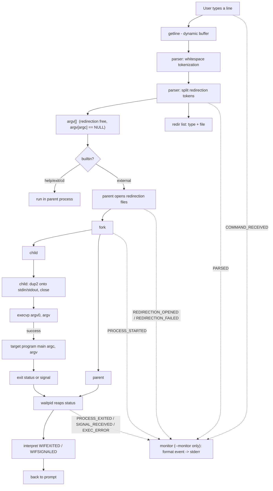

# Command Argument Passing System

An educational **C11 / POSIX** implementation of the core of a command
shell: tokenizing a command line, building a `NULL`-terminated `argv[]`,
and running the program through `fork()` → `execvp()` → `waitpid()`.

It is a *teaching* project, not a Bash replacement. Its purpose is to
make one piece of Unix legible that most users treat as a black box:

```text
command + arguments
        -> argv[]  (NULL-terminated)
        -> fork()
        -> execvp()
        -> target main(argc, argv)
        -> exit status / signal
        -> waitpid() in parent
```

**Positioning, stated honestly.** This is a small (≈1.5k LOC of C)
educational shell core, not a production shell. It implements one process per
command with synchronous reaping and deliberately omits the parts of a
real shell that require job control, pipelines, or a line editor. It is
useful as a reading/reference implementation of `fork`/`exec`/`waitpid`,
argv construction, descriptor redirection, signal hygiene, and
event-driven observability. It is **not** trying to be a Bash/dash/zsh
replacement, a performance tool, or a general-purpose job runner.

---

## Objectives

| # | Objective | Where it lives |
| - | --------- | -------------- |
| 1 | **Process creation** — `fork()` makes a child that duplicates the parent | `src/process.c` |
| 2 | **Process replacement** — `execvp()` replaces the child's image, same PID | `src/process.c` |
| 3 | **Argument passing** — tokens become `argv[]`; `argv[argc] == NULL` guaranteed | `src/parser.c` |
| 4 | **Synchronization** — parent blocks in `waitpid()` until the child ends | `src/process.c` |
| 5 | **Status interpretation** — `WIFEXITED`/`WEXITSTATUS` vs `WIFSIGNALED`/`WTERMSIG` | `src/process.c` |
| 6 | **IO redirection** — `>` / `>>` / `<` via `open()`/`dup2()`/`close()` | `src/parser.c`, `src/process.c` |
| 7 | **Signal hygiene** — parent survives Ctrl+C; child signals reported, not mishandled | `src/signals.c` |
| 8 | **Error recovery** — a failed `fork`/`exec`/`waitpid`, or a missing command, never kills the REPL | `src/main.c` |
| 9 | **Automated verification** — `make test` exercises every path above | `tests/` |
| 10 | **Real-time observability** — an optional event stream reports the lifecycle as it happens | `src/monitor.c` |

---

## Features

- **Interactive REPL** (`caps>`) with `help`, `exit [N]`, and `cd`.
- **One-shot mode** — `caps <command> [arg ...]` runs the pipeline once and exits with the child's status.
- **Redirection** — `>` (truncate), `>>` (append), `<` (input) in the REPL.
- **Correct child statuses** per shell convention: exit code `N`, `128 + signal`, `127` not found, `126` permission denied.
- **Robust child error path** — after a failed `execvp()`, the child writes to stderr with `write(2)` and `_exit()`s, never falling through into parent logic.
- **Debug mode** — `caps --parse` shows the exact `argv[]` a line produces.
- **Real-time execution monitoring** — `caps --monitor [--json]` emits the command lifecycle (`COMMAND_RECEIVED` → `PARSED` → `PROCESS_STARTED` → `PROCESS_EXITED`/`SIGNAL_RECEIVED`/`EXEC_ERROR`) as it happens, plus a session summary. See [`docs/monitor.md`](docs/monitor.md).

---

## Quick start

Requires a Linux / POSIX-like host with GCC or Clang, GNU Make, and a
`sh`-compatible shell. (The Windows-native MinGW toolchain is not a
suitable target for the POSIX process model.)

```sh
make            # builds ./caps (zero warnings with -Wall -Wextra -Wpedantic)
make test       # runs the full test suite against a fresh build
make test-asan  # runs the same suite under AddressSanitizer + UBSan
make clean      # removes build artifacts
```

## Usage

### Interactive session

```text
$ ./caps
Command Argument Passing System 0.1.0
Type 'help' for available commands.

caps> help
Built-in commands:
  help         show this message
  exit [N]     exit the shell with status N (default: last status)
  cd [dir]     change the working directory in this shell

Every other command is run as an external program through
fork() + execvp(); its arguments are passed as the program's
argv[1..]. The parent then waits with waitpid().
caps> echo hello world
hello world
caps> echo hello > out.txt
caps> cat out.txt
hello
caps> echo world >> out.txt
caps> cat out.txt
hello
world
caps> echo end > out.txt
caps> cat out.txt
end
caps> exit
$
```

The `caps>` prompt is diagnostic output and goes to **stderr**; external
programs' output goes to stdout. Redirection (`>`, `>>`, `<`) re-points
the child's stdin/stdout before `execvp()` — that is why `>` truncates
and `>>` appends exactly as a real shell would.

### One-shot mode

```sh
$ ./caps echo Hello World
Hello World

$ ./caps false; echo $?
1

$ ./caps no_such_cmd; echo $?
caps: command not found: no_such_cmd
127
```

### Parse debug mode

```sh
$ ./caps --parse
Command Argument Passing System 0.1.0 (--parse mode)
Enter a command line: echo Hello " World"
argc = 4
argv[0] = echo
argv[1] = Hello
argv[2] = "
argv[3] = World"
argv[4] = (null)
```

Note the parser does **not** interpret quotes — the double quotes above
are literal characters, and the tokenizer splits on whitespace only.

---

## Architecture

### Repository layout

```text
Command-Argument-Passing-System/
├── src/          C source files (one module per file)
├── include/      public headers for the modules
├── tests/        automated test scripts + C helper programs
├── docs/         design documentation
├── Makefile      build, clean, test, run targets
├── .gitignore    build artifacts and junk exclusions
├── .gitattributes LF normalization for text files
├── LICENSE
├── README.md     (this file)
└── ABSTRACT.docx (project abstract)
```

### Module map

| Module            | Responsibility |
| ----------------- | -------------- |
| `src/main.c`      | `main()` — banner, REPL loop, dispatch (built-in vs external) |
| `src/parser.c`    | whitespace tokenizer into `argv[]`; redirection-token extraction |
| `src/process.c`   | `fork()`/`execvp()`/`waitpid()` lifecycle; `open()`/`dup2()`/`close()` for redirection |
| `src/builtin.c`   | `help`, `exit`, `cd` — always run in the parent process |
| `src/signals.c`   | parent SIGINT disposition; child reset before `exec` |
| `src/monitor.c`   | optional event stream: text / one-JSON-object-per-line |
| `src/utils.c`     | `caps_error()` — `caps:`-prefixed stderr reporting |

Dependency direction is strict: `main -> process`, `main -> parser`,
`main -> builtin`, `main -> signals`, `main -> monitor`; `process`
emits monitor events and resets child signal dispositions. Lower layers
never call the REPL, and the monitor never influences execution.

### Data flow



### The core cycle

```text
command line
    |
    v
argv[]   (parser guarantees NULL terminator)
    |
    v
fork() ----------+
    |            |
(parent)      (child)
    |            |
waitpid()    execvp()
    |            |
    v            v
status    target program (same PID as child)
    |
    v
interpret: exit code | signal
```

**Why `fork` then `exec` and not a single call?**

- `execvp()` *replaces* the calling process. If `caps` exec'd directly,
  the interactive runner would vanish along with the prompt.
- `fork()` clones the runner; the clone (the child) is the one replaced
  by `execvp()`. The original runner (the parent) keeps executing, so it
  can continue the REPL after the child finishes.
- `waitpid()` gives the parent a rendezvous point: it suspends until
  the child terminates and lets the parent read the outcome.

---

## System calls at a glance

| Call        | Used for | Error behavior |
| ----------- | -------- | -------------- |
| `getline()` | line input (no fixed-size buffer) | `-1` on EOF/error |
| `strtok()`-free tokenization | splitting on whitespace | never fails |
| `fork()`    | creating the child | `-1` → reported, REPL survives |
| `execvp()`  | running the program | returns only on failure; `_exit(127/126)` |
| `waitpid()` | reaping the child | `-1` → reported, REPL survives |
| `open()`    | redirection files | `-1` → command aborted, REPL survives |
| `dup2()`    | wiring file descriptors onto stdin/stdout | `-1` in child → `_exit(1)` |
| `close()`   | releasing descriptors | best-effort (return value not actionable after `fork`) |
| `sigaction()` | SIGINT dispositions (parent `SIG_IGN`, child `SIG_DFL`) | `-1` → reported as a warning; shell keeps running |
| `clock_gettime()` | event durations (`CLOCK_MONOTONIC`) and display time (`CLOCK_REALTIME`) | failure not expected on Linux |

---

## Redirection

Supported in the interactive REPL only:

| Token | Mode | Open flags |
| ----- | ---- | ---------- |
| `<`   | input | `O_RDONLY` |
| `>`   | truncate output | `O_WRONLY | O_CREAT | O_TRUNC` |
| `>>`  | append output | `O_WRONLY | O_CREAT | O_APPEND` |

The lifecycle in `process_exec()`:

1. the **parent** opens every file before `fork()` — a missing input
   file or unwritable target aborts the command with no child created;
2. the **child** `dup2()`s each descriptor onto stdin/stdout and
   `close()`s the originals before `execvp()`; if `open()` already
   returned the destination slot itself (e.g. stdout was closed), that
   descriptor is kept as-is instead of being dup'd over and closed —
   the closed-fd edge case that would otherwise empty the target file;
3. the **parent** `close()`s its own copies (best-effort), then
   `waitpid()`s.

**Grammar.** The operator must be a whitespace-separated token equal to
exactly `<`, `>` or `>>`: `echo hi > f` redirects; `echo hi >f` and
`echo hi> f` pass literal arguments and do not redirect.

**Multiple redirections.** All operators on a line are honored in the
order their file tokens appear. Since `<` always targets fd 0 and `>`/
`>>` always target fd 1, a repeated target means *last one wins*:
`echo hi > a > b` writes to `b` (both files are still opened/truncated).

The parser validates redirection tokens before touching anything: a
line that ends in `>` (missing file) is a syntax error, and `> out`
with no command is also rejected. Built-ins (`help`/`exit`/`cd`) reject
redirection. See [`docs/redirection.md`](docs/redirection.md).

---

## Signal handling

- The **parent** ignores `SIGINT` for its lifetime, so Ctrl+C never
  kills the prompt.
- The **child** `sigaction()`s `SIGINT` back to `SIG_DFL` right after
  `fork()` and before `execvp()`. This matters because POSIX `exec`
  preserves `SIG_IGN` dispositions: without the reset, a foreground
  child like `sleep 3` would ignore Ctrl+C too.
- Termination of a child by a signal is reported
  (`caps: 'cmd' terminated by signal N`) and folded into the last
  status as `128 + N`. See [`docs/signals.md`](docs/signals.md).

`sigaction()` failures are not ignored: `signals_parent_init()` warns
(`SIGINT setup failed; Ctrl+C may terminate the shell`) and the REPL
continues, and `signals_child_reset()` warns in the child before
executing.

---

## Real-time execution monitoring

`caps --monitor [--json]` attaches an **event-driven, real-time** view
of command execution. Events are emitted the instant each step occurs
and flushed immediately to **stderr** — there is no polling, no
monitoring thread, no `sleep()`, and no end-of-run buffering. The
monitor is a write-only observer: normal builds pass a `NULL` sink and
behave identically.

| Command | Effect |
| ------- | ------ |
| `caps --monitor` | interactive REPL with events |
| `caps --monitor echo hi` | one-shot execution with events |
| `caps --monitor --json` | one JSON object per line (banner and prompt suppressed) |
| `caps --monitor --json echo hi` | one-shot, machine-readable |

Events: `COMMAND_RECEIVED`, `PARSED`, `COMMAND_PARSE_ERROR`,
`REDIRECTION_OPENED`/`REDIRECTION_FAILED`, `PROCESS_STARTED`,
`PROCESS_EXITED`, `SIGNAL_RECEIVED`, `EXEC_ERROR`, and a final
`SESSION_SUMMARY`.

```text
$ ./caps --monitor --json sh -c 'exit 7'
{"event":"COMMAND_RECEIVED","time":"10:00:00.001","command":"sh -c exit 7"}
{"event":"PARSED","time":"10:00:00.001","command":"sh -c exit 7"}
{"event":"PROCESS_STARTED","time":"10:00:00.002","pid":4242,"command":"sh -c exit 7"}
{"event":"PROCESS_EXITED","time":"10:00:00.004","pid":4242,"exit_code":7,"duration_ms":2,"command":"sh -c exit 7"}
{"event":"SESSION_SUMMARY","commands":1,"succeeded":0,"failed":1,"signals":0,"timed":1,"average_duration_ms":2.0}
```

`duration_ms` is real elapsed time from `CLOCK_MONOTONIC`; the `time`
field is display-only wall-clock time from `CLOCK_REALTIME`. One honest
limitation: `EXEC_ERROR` is raised when a child exits `126`/`127`, the
shell convention for a failed `exec`; a program that itself exits `127`
is indistinguishable at this layer. Full reference:
[`docs/monitor.md`](docs/monitor.md).

---

## Error handling

Every command failure is per-command and must never kill the REPL.

| Failure | Behavior |
| ------- | -------- |
| empty / whitespace line | ignored silently |
| unknown command | `caps: command not found: <cmd>` (status 127) |
| permission denied | `caps: <cmd>: permission denied` (status 126) |
| redirection, malformed line | `caps: syntax error: '<op>' requires a file name` |
| redirection, no command | `caps: syntax error: no command to redirect` |
| redirection `open()` fails | `caps: <file>: <strerror(errno)>`; command aborted |
| `fork()` fails | `caps: fork: <strerror(errno)>` |
| `waitpid()` fails | `caps: waitpid: <strerror(errno)>` |
| invalid `exit` argument | `caps: exit: invalid status: '<arg>' (expected an integer in the range 0..255)`; REPL continues, last status 1 |
| `sigaction()` fails | `caps: warning: SIGINT setup failed; Ctrl+C may terminate the shell`; REPL continues |
| EOF at prompt | newline + clean exit with last status |

Diagnostics go to **stderr**; successful commands are quiet.

---

## Testing

`make test` runs ten POSIX-shell test scripts that pipe scripted input
into a fresh `./caps` build and assert on stdout/stderr. A small C
helper (`tests/helpers/status_probe.c`) is compiled by the harness so
exit codes and signals can be tested deterministically.

| Script | Coverage |
| ------ | -------- |
| `test_smoke.sh` | end-to-end sanity: echo, help, cd, errors, signals |
| `test_parser.sh` | empty/whitespace input, single/multi args, tab handling |
| `test_execution.sh` | one-shot and REPL execution, argument passing |
| `test_errors.sh` | unknown command, non-executable file, REPL resilience |
| `test_exit_status.sh` | exit codes, signal termination, 128+N, last-status |
| `test_signals.sh` | child SIG_DFL reset, parent survival, status reporting |
| `test_redirection.sh` | `>`/`>>`/`<`, combined, syntax errors, built-in rejection |
| `test_exit_parse.sh` | `exit` argument validation: range, junk, overflow, REPL continuation |
| `test_fd_edge.sh` | redirection while a standard descriptor is closed (`fd == target`) |
| `test_monitor.sh` | monitor event ordering, JSON shape, session summary |

`make test-asan` is the same suite rebuilt with AddressSanitizer and
UndefinedBehaviorSanitizer (leak detection enabled).

---

## Documentation

| Document | Contents |
| -------- | -------- |
| [`docs/requirements.md`](docs/requirements.md) | normative behavior, scope, error model, definition of done |
| [`docs/architecture.md`](docs/architecture.md) | module layout, data flow, build/test design, design decisions |
| [`docs/process-lifecycle.md`](docs/process-lifecycle.md) | `fork`/`exec`/`wait` semantics, status macros, child safety rules |
| [`docs/argument-passing.md`](docs/argument-passing.md) | text → `argv[]` → `main(argc, argv)` transmission |
| [`docs/signals.md`](docs/signals.md) | signal dispositions, exec interaction, limitations |
| [`docs/redirection.md`](docs/redirection.md) | fd model, `open`/`dup2`/`close`, parser contract, limitations |
| [`docs/monitor.md`](docs/monitor.md) | real-time event model, formats, honest limits |
| [`docs/development-phases.md`](docs/development-phases.md) | engineering roadmap and phase records |

---

## Limitations

Documented honestly rather than hidden:

- no quoting, escapes, globs, environment expansion, or command
  substitution — the tokenizer splits on whitespace and passes tokens
  literally;
- no pipelines (`|`), `&&`/`||`, background jobs, or job control;
- redirection applies to external commands in the REPL only; one-shot
  mode passes `>`/`<` literally as arguments;
- no fd-number redirection (`2>`), heredocs, process substitution, or
  `&>`;
- built-ins run in the parent; redirecting them is rejected;
- redirection operators must be whitespace-separated whole tokens, and
  multiple redirections to the same slot follow last-one-wins;
- `exit N` accepts only an integer in `0..255`; anything else is
  reported and the REPL continues;
- no job control, no process groups, and no line editing at the prompt
  (Ctrl+C at an idle `caps>` prompt does nothing — the parent ignores
  SIGINT);
- the monitor is observational only: it reports parent-side lifecycle
  facts, its `EXEC_ERROR` event is the `126`/`127` heuristic, and it has
  no persistence.

All are recorded in `docs/requirements.md §4.3` and the per-feature
documents.

---

## Future work

- Pipeline support (`cmd1 | cmd2`) via `pipe()` + two `fork()`s + `dup2()`.
- Quoting and escape handling in the tokenizer.
- `&` background execution with simple job tracking.
- fd-number redirection (`2>`, `1<`).
- A line editor for the prompt (so Ctrl+C can cancel the current line).
- Optional on-disk persistence for monitor events (`--monitor --log FILE`).

---

## Design decisions

| Decision | Rationale |
| -------- | --------- |
| `getline()` not `fgets()` | dynamic sizing; no arbitrary line-length limit |
| `execvp()` over `execve()` | PATH search; no env plumbing needed here |
| `fork()` rather than `system()` | explicit process model — the project's purpose |
| `waitpid(pid,...)` not `wait()` | unambiguous relation to the exact child |
| `_exit()` in the child after failed `exec` | skips stdio flushing that would duplicate parent buffers; the child region is **not** a signal-handler context, so this is a buffer-safety choice, not an async-signal-safety requirement |
| module map introduced per phase | complexity appears incrementally; clarity first |
| diagnostics on stderr, output on stdout | keeps success output clean and scriptable |
| monitor as a NULL-able observer | zero cost and zero behavioral change when disabled; events emitted only under `--monitor` |

---

## Author

**Karkala Shiva Reddy** — [GitHub](https://github.com/karkalashivareddy)

Licensed under the MIT License. See [LICENSE](LICENSE).
