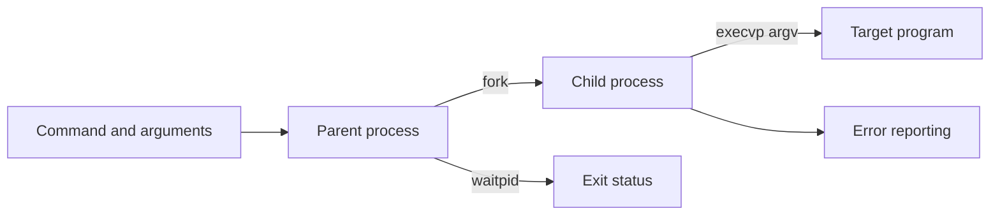

# Command Argument Passing System

This repository currently contains the project abstract for a proposed C/Linux demonstration of process creation, argument passing, execution, and synchronization. The Git history at `main` contains `README.md` and [`ABSTRACT.docx`](ABSTRACT.docx); it does not currently contain a C source file, Makefile, or executable implementation.

## Intended design

The abstract describes a parent process that:

1. accepts a command and its arguments;
2. creates a child with `fork()`;
3. executes the requested program with an `exec*()` call such as `execvp()`;
4. lets the child receive/display its argument vector;
5. waits for completion with `wait()`/`waitpid()`; and
6. reports invalid commands without terminating the parent prematurely.

The diagram represents the documented design, not a claim that those steps are executable from the current checkout.

## Source of truth and status

- **Status:** abstract/design artifact; implementation source is not present in this repository version.
- **Language/environment described:** C on Linux/Unix.
- **Document:** [`ABSTRACT.docx`](ABSTRACT.docx).

To make this repository runnable, the next step would be to add a small C program, a reproducible build command (or Makefile), and tests for valid commands, missing commands, empty arguments, child exit status, and signal/error paths.

## Author

**Karkala Shiva Reddy** — [GitHub](https://github.com/karkalashivareddy)
