# CAPS — Process Execution Observatory

**Version: 2.0.0** - Linux process execution, host observability, and pipeline evidence


[](https://github.com/karkalashivareddy/Command-Argument-Passing-System/actions/workflows/ci.yml)
    


> **CAPS is a Linux process execution observatory that makes the lifecycle of a
> real command inspectable:** structured argv → `fork()` → `execvp()` → Linux
> process execution → `waitpid()` → persisted events → real-time telemetry →
> replay.
>
> **The system does not simulate process behaviour. The browser visualizes
> evidence produced by the real Linux execution path.**

---

## The problem

A command such as `sleep 5` looks trivial from a terminal. Internally it
crosses at least ten system boundaries:

```
browser request
  -> validated argv
    -> gateway
      -> CAPS engine
        -> fork()
          -> execvp()
            -> Linux kernel process
              -> /proc telemetry
                -> waitpid()
                  -> event persistence
                    -> real-time stream
                      -> replayable investigation
```

Conventional command execution hides almost all of that. You see the exit code
and, if you looked, the wall-clock time. You do not see:

* whether the program was ever **exec'd**, or whether `execvp()` failed;
* the real `argv` the program received;
* the PID, its PPID, and whether the PID was even still the same process by
  the time you looked;
* what its RSS, CPU time, page faults, and I/O counters did *during* the run;
* an ordered, replayable record of any of it.

Debuggers, tracers, and production APM systems each answer part of this with
substantial machinery. CAPS answers a narrower version of it with a system a
single engineer can read end to end: a 2 000-line C engine, a typed gateway, and
a view-model layer that refuses to show a number the kernel did not report.

## The solution

CAPS runs real commands through a real POSIX lifecycle and records what the
kernel reports, as evidence, in an order that can be replayed.

| Capability | Where it lives |
| --- | --- |
| Real process execution via `fork`/`execvp`/`waitpid` | `src/process.c` |
| Structured argv, never a shell string | `web/backend/src/security/policy.ts` |
| Command allowlist with trusted executable resolution | `web/backend/src/security/policy.ts` |
| Loopback-by-default security boundary, fail-closed | `web/backend/src/config/env.ts` |
| Real procfs telemetry with per-metric provenance | `web/backend/src/telemetry/collector.ts` |
| Canonical, contiguous, validated event history | `web/backend/src/events/invariants.ts` |
| Race-free SSE with resume by sequence | `web/backend/src/events/bus.ts` |
| Flight-recorder replay (read-only, never re-executes) | `web/backend/src/api/routes.ts` |
| PID-reuse-safe identity across three layers | `web/backend/src/execution/terminator.ts`, `web/frontend/src/lib/evidenceCorrelation.ts` |
| Cross-view evidence correlation (one decision function) | `web/frontend/src/lib/evidenceCorrelation.ts` |
| 2D process graph and 3D Process Space | `web/frontend/src/components/space/` |
| Analytics, comparison, JSON/CSV/Markdown export | `web/backend/src/analytics/service.ts` |
| Bounded first-party workload laboratory | `workloads/` |

## Architecture

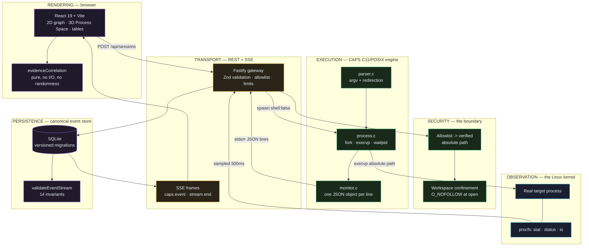
```mermaid
flowchart TD
    subgraph B["RENDERING — browser"]
        UI["React 19 + Vite<br/>2D graph · 3D Process Space · tables"]
        CORR["evidenceCorrelation<br/>pure, no I/O, no randomness"]
        UI --> CORR
    end

    subgraph T["TRANSPORT — REST + SSE"]
        GW["Fastify gateway<br/>Zod validation · allowlist · limits"]
        SSE["SSE frames<br/>caps.event · stream.end"]
    end

    subgraph S["SECURITY — the boundary"]
        ALLOW["Allowlist -&gt; verified<br/>absolute path"]
        WS["Workspace confinement<br/>O_NOFOLLOW at open"]
        GW --> ALLOW --> WS
    end

    subgraph E["EXECUTION — CAPS C11/POSIX engine"]
        PARSE["parser.c<br/>argv + redirection"]
        EXEC["process.c<br/>fork · execvp · waitpid"]
        MON["monitor.c<br/>one JSON object per line"]
        PARSE --> EXEC --> MON
    end

    subgraph K["OBSERVATION — the Linux kernel"]
        PROC["Real target process"]
        PROCFS["procfs: stat · status · io"]
        PROC --- PROCFS
    end

    subgraph P["PERSISTENCE — canonical event store"]
        DB[("SQLite<br/>versioned migrations")]
        IDX["validateEventStream<br/>14 invariants"]
        DB --> IDX
    end

    UI -->|"POST /api/sessions"| GW
    GW -->|"spawn shell:false"| EXEC
    EXEC -->|"execvp absolute path"| PROC
    PROCFS -->|"sampled 500ms"| GW
    MON -->|"stderr JSON lines"| GW
    GW --> DB
    DB --> SSE --> UI

    classDef exec fill:#1a2a1a,stroke:#3ecf8e,color:#e6edf3
    classDef obs fill:#1a2030,stroke:#22c3ee,color:#e6edf3
    classDef pers fill:#221a2a,stroke:#8b7cf6,color:#e6edf3
    classDef trans fill:#2a2418,stroke:#f5a623,color:#e6edf3
    classDef rend fill:#1f1a2a,stroke:#c084fc,color:#e6edf3
    class ALLOW,WS,EXEC,PARSE,MON exec
    class PROC,PROCFS obs
    class DB,IDX pers
    class GW,SSE trans
    class UI,CORR rend
```

Read the diagram as five separately-owned concerns:

* **EXECUTION** — only `./caps` calls `fork()` and `execvp()`. The gateway never
  does; it spawns the engine with an explicit argv array and `shell: false`.
* **OBSERVATION** — telemetry comes from `/proc` for each direct PID reported
  by CAPS: one for a command or one per pipeline stage. Nothing is simulated,
  and arbitrary descendants are not discovered.
* **PERSISTENCE** — SQLite holds the canonical history. A second process table
  was removed precisely so there is only one source of truth.
* **TRANSPORT** — SSE carries canonical events and a distinct end-of-stream
  frame. Only events carry an `id:`, and that id is a real session sequence.
* **RENDERING** — the browser is a view. It executes no processes and it
  re-derives nothing the event store already says.

Full detail, including the trust boundaries and the fourteen event-stream
invariants, is in [docs/architecture.md](docs/architecture.md).

## End-to-end execution flow

One concrete request — `echo Hello CAPS` — through the whole system.

| # | Step | Class | Where |
| --- | --- | --- | --- |
| 1 | Browser posts `{command: "echo", args: ["Hello CAPS"]}` | — | `api/client.ts` |
| 2 | Zod validates shape, size, and semantics | OBSERVED (of the request) | `api/routes.ts` |
| 3 | `echo` resolves to `/usr/bin/echo` via `realpath` + `lstat` + `access(X_OK)` | OBSERVED | `security/policy.ts` |
| 4 | Session row, redirection rows, and `execution.created` are written in **one transaction** | — | `db/repositories/sessions.ts` |
| 5 | Gateway spawns `./caps --monitor --json /usr/bin/echo Hello CAPS`, `shell: false` | — | `execution/runner.ts` |
| 6 | CAPS tokenizes; no shell, no globbing, no expansion | — | `parser.c` |
| 7 | CAPS calls `fork()` | OBSERVED | `process.c` |
| 8 | Child restores `SIGINT` to `SIG_DFL` — **or refuses to exec** | OBSERVED | `signals.c` |
| 9 | Child calls `execvp("/usr/bin/echo", …)` | OBSERVED | `process.c` |
| 10 | Linux runs the real process | OBSERVED | kernel |
| 11 | Gateway samples `/proc/<pid>/{stat,status,io}` every 500 ms | OBSERVED | `telemetry/collector.ts` |
| 12 | CAPS emits one JSON object per line on stderr, with `outcome` and, on failure, `errno` | OBSERVED | `monitor.c` |
| 13 | Gateway classifies each stderr line, normalizes, assigns the next sequence | — | `execution/output.ts`, `normalizer.ts` |
| 14 | SQLite persists the event **before** the bus publishes it | — | `db/repositories/events.ts` |
| 15 | SSE delivers a `caps.event` frame with `id: <sequence>` | — | `events/sse.ts` |
| 16 | React derives 2D and 3D state from the same correlation function | — | `lib/evidenceCorrelation.ts` |
| 17 | Replay later reconstructs the record from persisted events only | — | `api/routes.ts` |

**Replay is reconstruction, not re-execution.** It performs no `fork()`, no
`execvp()`, no `open("/proc/...")`, and no write. Two consecutive replays
return a byte-identical event fingerprint, and the smoke suite asserts it.

## Why this project is technically interesting

1. **Real execution, not simulation.** The C engine actually runs Linux
   processes. A test that changes the kernel's behaviour changes CAPS.

2. **Structured argv end to end.** The web gateway never concatenates a
   command string for shell interpretation. `command` and `args` are separate
   fields, validated separately, and passed as an argv array.

3. **Shell-free by construction.** `shell: false` in the gateway, and no shell
   on the allowlist, because `sh -c` would turn an argv allowlist into
   arbitrary execution.

4. **Evidence-first observability.** Every metric in a `process.snapshot`
   carries its own provenance. The API publishes the classification per metric,
   so no client has to infer it.

5. **PID-reuse protection across three layers.** A PID is not an identity. The
   gateway refuses a delayed `SIGKILL` whose kernel start time changed, the
   sampler stops when start ticks change mid-run, and the frontend keys its
   index by `role:pid@start`.

6. **Replay is read-only.** Proven, not asserted: the smoke suite fingerprints
   the event stream before and after and compares.

7. **A canonical event history with checked invariants.** Fourteen invariants,
   structured diagnostics rather than a boolean, enforced on replay, on export,
   and in the Markdown report.

8. **Race-free delivery.** The SSE handler subscribes with a buffer *before* it
   reads the store, so a client never misses a persisted event because it
   connected at the wrong moment.

9. **Cross-view correlation by construction.** The timeline, the process
   inspector, the 2D graph, and the 3D space all ask one pure function the same
   question, so they cannot drift apart. A test asserts they agree.

10. **Degraded-mode honesty.** A missing WebGL context, an unreadable procfs
    field, a rate on the first sample, a CPU counter that went backwards — all
    are shown as `UNAVAILABLE` with a reason, never as a zero.

11. **Verification driven by failure modes.** The suites are weighted toward
    what breaks: a failed `execvp()`, a failed `waitpid()`, a recycled PID, a
    symlink planted between validation and open, a corrupt stored payload, an
    SSE reconnect, a database from a newer schema.

## Evidence model

Every displayed value is one of three things, and the UI distinguishes them.

| Class | Meaning |
| --- | --- |
| `OBSERVED` | read from the kernel on this sample |
| `DERIVED` | computed from one or more observations |
| `UNAVAILABLE` | not produced, with the reason stated |

| Value | Class | Basis |
| --- | --- | --- |
| PID, PPID, process group, SID | `OBSERVED` | `/proc/<pid>/stat`, `/proc/<pid>/status` |
| RSS, virtual memory, threads, context switches | `OBSERVED` | `/proc/<pid>/status` |
| Minor/major faults, I/O counters (`rchar`, `wchar`, `read_bytes`, `write_bytes`) | `OBSERVED` | `/proc/<pid>/stat`, `/proc/<pid>/io` |
| CPU user/system time (ms) | `DERIVED` | kernel tick counters converted with `CLK_TCK` |
| CPU utilization % | `DERIVED` | delta of two valid samples over a measured interval |
| I/O and fault rates | `DERIVED` | delta of two cumulative counters over a measured interval |
| Process start time | `DERIVED` | `btime + startTicks/CLK_TCK` — a pure function of kernel values |
| Any rate on the **first** sample | `UNAVAILABLE` | a rate is a statement about an interval |
| Any counter that **decreased** | `UNAVAILABLE` | a decrease means the identity changed, not that nothing was measured |
| An unreadable or denied procfs field | `UNAVAILABLE` | carries the real kernel errno |
| Exec success | `DERIVED` | from the engine's own `outcome` on the exit event; there is no separate "exec ok" event |
| A `SESSION_SUMMARY` event | **not** success | it means the monitor closed; a failed `execvp()` emits one too |

`GET /api/capabilities` publishes this classification as `observedMetrics`,
`derivedMetrics`, `gatewayMetrics`, and `metricProvenance`.

## Process identity

```
(sessionId, PID, processStartTime)
```

A bare PID is not an identity. Linux recycles PIDs, and a recycled PID is a
*different* process. CAPS therefore:

* **anchors the start time from kernel values** — `btime` from `/proc/stat`
  plus field 22 of `/proc/<pid>/stat`, converted with `CLK_TCK`. This is a
  pure function of the kernel's own numbers, so it is byte-identical for every
  sample of one process. (`now - uptime` was the previous approach and it
  drifted by a sub-jiffy lag on every sample.)
* **uses the same identity model in all three layers**:
  * gateway — a delayed `SIGKILL` re-reads `/proc/<pid>/stat` and refuses to
    fire if the start ticks changed;
  * telemetry — sampling stops the moment a tracked PID's start ticks change,
    and a PID whose observed PPID is not the gateway-spawned engine is rejected;
  * frontend — the correlation index is keyed by `role:pid@start`, and a PID
    seen with two start times is reported as a collision rather than merged.

**PID alone is never treated as a sufficient identity when a start time is
available.** Where no start time exists, the match degrades to session + PID and
says so through `identityConfidence`, rather than pretending to be strong.

→ `web/backend/src/execution/terminator.ts` ·
`web/frontend/src/lib/evidenceCorrelation.ts` ·
`web/frontend/src/lib/hardening.test.ts`

## Real-time model

```
CAPS monitor events
  -> normalized + sequenced
    -> persisted to SQLite FIRST
      -> published on the event bus
        -> SSE frame (caps.event, id: <sequence>)
          -> frontend state
```

The persisted event is always written before the bus is told, so a client can
never receive an event that replay would not return. On reconnect the browser
sends `Last-Event-ID`, which is a real session sequence, and the gateway
replays from the store.

The `stream.end` frame carries **no `id:`**, so `Last-Event-ID` can only ever
hold a sequence that exists. (The previous implementation wrote
`Number.MAX_SAFE_INTEGER` there, which made a reconnecting client resume from a
position past the end of the stream.)

Replay is the same store read without a side effect:

```
persisted evidence -> reconstruction
```

never

```
persisted evidence -> re-execution
```

## Security model

The gateway executes commands, so its boundary is enforced in code and covered
by tests. The full threat model, including what is deliberately **out of
scope**, is in [SECURITY.md](SECURITY.md).

| Threat | Mitigation |
| --- | --- |
| Shell injection | Structured argv array; `shell: false`; no shell on the allowlist |
| Arbitrary executable | Server-side allowlist resolved to a verified absolute path; `PATH` is never consulted for an allowlisted command |
| Symlinked or swapped binary | `realpath` canonicalisation, `lstat` regular-file check, symlinked binary refused |
| Path traversal | Workspace-relative names only; `..`, `~`, absolute paths, symlink components, and empty values rejected |
| Symlink race at open time | Engine opens each parent with `openat(O_DIRECTORY|O_NOFOLLOW)`, opens the final component with `O_NOFOLLOW`, and verifies a regular file before use |
| PID reuse | PID + kernel start time verified before every delayed escalation |
| Runaway process | Timeout → `SIGTERM` → identity-verified `SIGKILL` |
| Excess output | Configurable output cap per session, per channel |
| Concurrent abuse | Session concurrency limit enforced before spawn |
| Remote exposure | Refuses to start on a non-loopback address unless remote mode is explicitly enabled; remote mode requires a bearer token |
| Secret leakage | Child environment is `PATH`/`LANG`/`HOME`/`TERM` only; the token is never logged |

Two properties are enforced *fail-closed* rather than warned about:

```sh
# Refuses to start.
CAPS_HOST=0.0.0.0 node web/backend/dist/server.js
# Refuses to start: remote mode requires CAPS_AUTH_TOKEN.
CAPS_BIND_MODE=remote CAPS_HOST=0.0.0.0 node web/backend/dist/server.js
```

## Core workspaces

| Route | Workspace | Question it answers |
| --- | --- | --- |
| `/` | Overview | What has this observatory recorded? |
| `/execute` | Execute | What command should CAPS execute, and what does the gateway allow? |
| `/execution/:id` | Flight Recorder | What actually happened during this run, event by event? |
| `/execution/:id/3d` | 3D Process Space | How does process identity and lifetime map spatially? |
| `/live` | Live | What is executing right now, across all sessions? |
| `/processes` | Processes | Which observed process identities exist, and their state? |
| `/history` | History | Which executions have been recorded, and can they be replayed? |
| `/analytics` | Analytics | What patterns exist across stored executions? |
| `/compare` | Compare | How do two real executions differ? |
| `/signals` | Signals | How did signal delivery affect the process? |
| `/redirection` | Redirection | How were file descriptors configured before `execvp()`? |
| `/arguments/:id` | Argument passing | What exact argv did the program receive? |
| `/playground` | Playground | Which controlled demonstrations are available? |
| `/architecture` | Architecture | How does the system work? |
| `/settings` | Settings | What are the engine, limits, and readiness state? |

## The 3D Process Space

**The 3D scene is not another telemetry source. It visualizes canonical
recorded evidence.** Nothing is read from `/proc` in the browser, and the scene
cannot show a value the event store does not contain.

```
X = deterministic process lane   (stable per role and PID, so a node does not move)
Y = process depth                (engine above the child it forked)
Z = execution time               (milliseconds since the record's first event)
```

* **Nodes** — one per observed process identity, keyed by `role:pid@start`.
* **Edges** — only when the child observed a PPID equal to an observed parent
  PID. An unverified relationship is not drawn.
* **Lifetime bars** — from the first evidence for that identity to its recorded
  end.
* **Event markers** — placed at their real recorded timestamps, never
  interpolated.
* **Shared cursor** — one cursor, shared with the 2D timeline. The store is
  session-scoped, so a cursor from one execution can never be applied to
  another.
* **Resource lenses** — CPU, memory, I/O, and faults, switching the colour
  channel of the same nodes.
* **Replay** — scrubbing is reconstruction from persisted events.
* **Fallbacks** — WebGL unavailable falls back to a 2D canvas; the 2D canvas
  falls back to an accessible table. The fallback is a real surface, not an
  error page.
* **Scene reading** — the CAPS engine uses a cylindrical core; observed child
  processes use rounded forms. Lifecycle colour remains tied to recorded state,
  while selection and verified relationships use a separate violet accent.
  Camera presets frame the record from its observed bounds, and the resource
  lens continues to control only the recorded resource encoding.

The application shell keeps the ambient field mounted through navigation.
Workspace changes use a short opacity and depth transition; query-only changes
do not replay it. Major below-the-fold sections reveal as they enter the main
scroll region. The scroll-progress line follows that same container, and
returning through browser history restores the saved workspace position.
Reduced-motion preferences disable the route displacement and section reveals,
and use immediate scroll restoration.

The 2D and 3D views consume the *same* correlation function, and a test asserts
that one record produces the same selected event, identity, node key, cursor
moment, and identity confidence in both.

## Workload lab

Five first-party C programs under `workloads/`, built by `make workloads` into
`build/workloads/`. Every bound is declared once in `workloads/workload_common.h`
and re-enforced by the C program, and mirrored in the gateway catalog — so a
bug in any one layer still cannot run an unbounded workload.

| Workload | Purpose | Bounded parameters | Telemetry demonstrated |
| --- | --- | --- | --- |
| `caps_cpu_burn` | Sustained arithmetic on one core | seconds (1–30) | `cpuUserMs`, `cpuSystemMs`, `cpuPercent`, `elapsedMs` |
| `caps_memory_burn` | Touches every page of a private anonymous mapping | seconds, MiB (1–256) | `rssBytes`, `virtualMemoryBytes`, `minorFaults` |
| `caps_io_burn` | Writes and reads back a bounded file in a private `mkdtemp` workspace | seconds, MiB (1–64) | `rcharBytes`, `wcharBytes`, `readBytes`, `writeBytes` |
| `caps_mixed_burn` | CPU + memory + I/O interleaved on one PID | seconds, MiB, MiB | `cpuPercent`, `rssBytes`, I/O counters |
| `caps_fork_tree` | Bounded parent → children → grandchild topology, all reaped | seconds, children (1–4) | fork activity of the tracked process |

**`caps_fork_tree` observes the direct process only.** For a pipeline CAPS
reports each direct stage and the gateway samples each stage independently.
The gateway does not discover processes those commands fork. The descendant
topology genuinely exists at the kernel level and the workload's own C test
asserts it by reading `/proc` directly, but **the gateway never sees those
descendants**: no node, no edge, no per-descendant metric. The profile publishes
this as an explicit `observationScope` in `/api/capabilities` so the UI cannot
imply coverage the sampler does not provide.

## Quick start

### Prerequisites

* **Linux**, or **WSL2 on Windows** for the engine and the gateway.
* A C11 compiler (`gcc` or `clang`) and `make`.
* **Node.js 22+** (the gateway uses the built-in `node:sqlite`).

```bash
git clone https://github.com/karkalashivareddy/Command-Argument-Passing-System.git
cd Command-Argument-Passing-System
```

### Build and run

```bash
# 1. Build the C engine and the controlled workloads
make

# 2. Install web dependencies
cd web/backend  && npm ci && cd -
cd web/frontend && npm ci && cd -

# 3. Start the gateway (binds 127.0.0.1:3000)
cd web/backend
node --disable-warning=ExperimentalWarning node_modules/tsx/dist/cli.mjs src/server.ts

# 4. In a second terminal, start the frontend
cd web/frontend
npm run dev            # http://127.0.0.1:5173
```

Open <http://127.0.0.1:5173>.

### Environment variables

All optional; the defaults are a working local setup.

| Variable | Default | Purpose |
| --- | --- | --- |
| `CAPS_HOST` | `127.0.0.1` | Bind address. Must be loopback unless `CAPS_BIND_MODE=remote`. |
| `CAPS_PORT` | `3000` | Gateway port. |
| `CAPS_BIND_MODE` | `local` | `local` (loopback only) or `remote` (requires a token). |
| `CAPS_AUTH_TOKEN` | — | Bearer token, ≥ 32 chars. **Required** in remote mode, **rejected** in local mode. |
| `CAPS_EXECUTABLE` | `<repo>/caps` | Path to the C engine binary. |
| `CAPS_WORKSPACE` | `<repo>/data/work` | Directory that confines redirection targets. |
| `CAPS_DATABASE_PATH` | `<repo>/data/caps-observatory.db` | SQLite file. |
| `CAPS_MAX_CONCURRENT` | `4` | Concurrent execution limit. |
| `CAPS_DEFAULT_TIMEOUT_MS` | `30000` | Default execution timeout (max 120000). |
| `CAPS_MAX_OUTPUT_BYTES` | `65536` | Output cap per session, per channel. |
| `CAPS_RETENTION_DAYS` | `0` | `0` keeps everything. Retention is explicit. |
| `CAPS_LOG_LEVEL` | `info` | `debug` \| `info` \| `warn` \| `error` |

Check the boundary is holding:

```bash
curl -s http://127.0.0.1:3000/api/ready | jq '.ready, .checks'
```

## Screenshots

The before and after images use the same 1440×1000 desktop viewport. The new
captures come from the production frontend and the running Linux gateway using
[`capture-screenshots.mjs`](web/frontend/scripts/capture-screenshots.mjs).
Commands and events shown are real; the 3D image uses the three-stage pipeline
recording. The mobile captures use 390×844 with reduced motion enabled.

| Before | Redesigned overview |
| --- | --- |
| 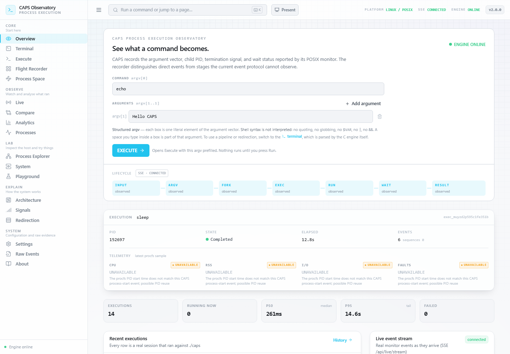 | 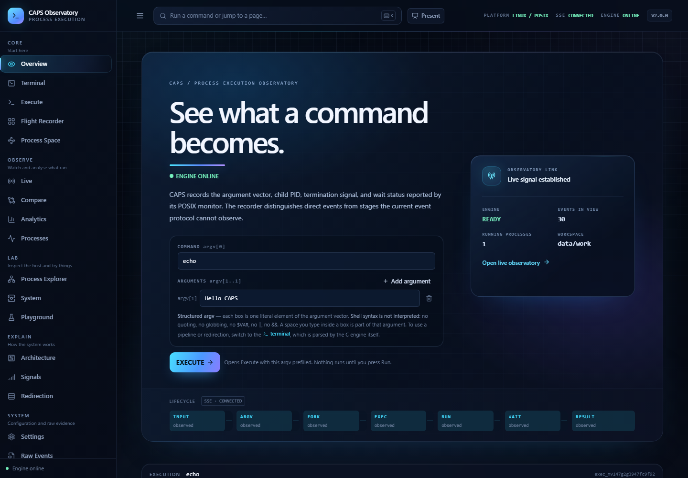 |

### Workspaces

| Surface | Capture |
| --- | --- |
| Terminal | 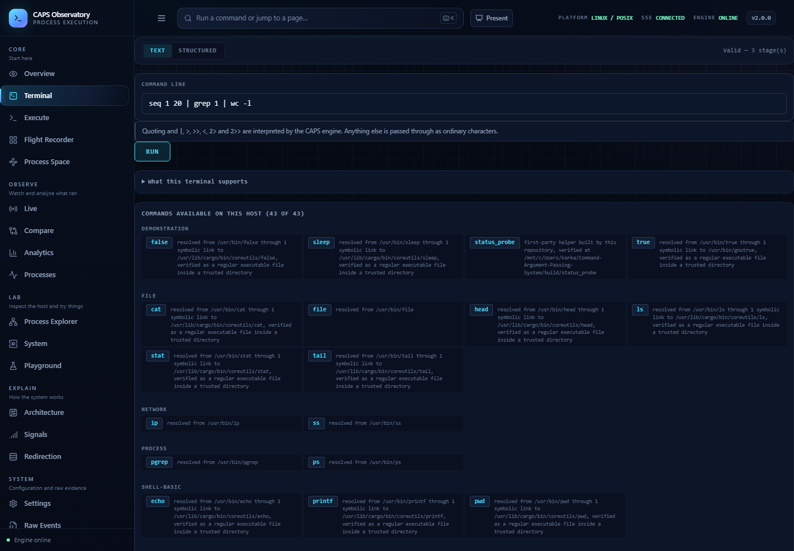 |
| Execution workbench | 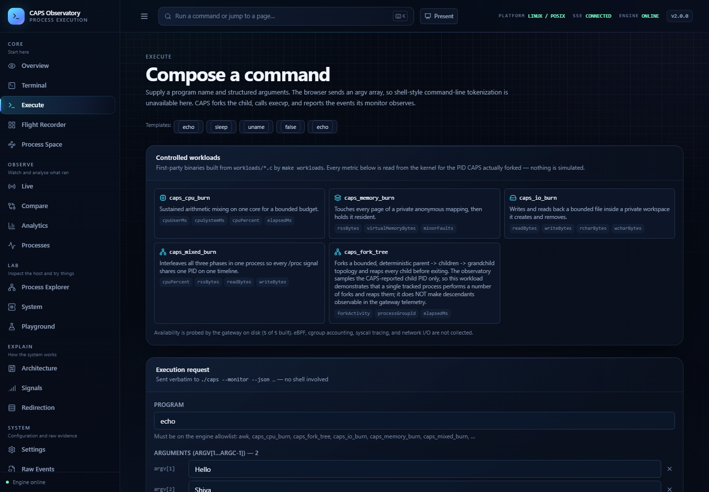 |
| Flight recorder | 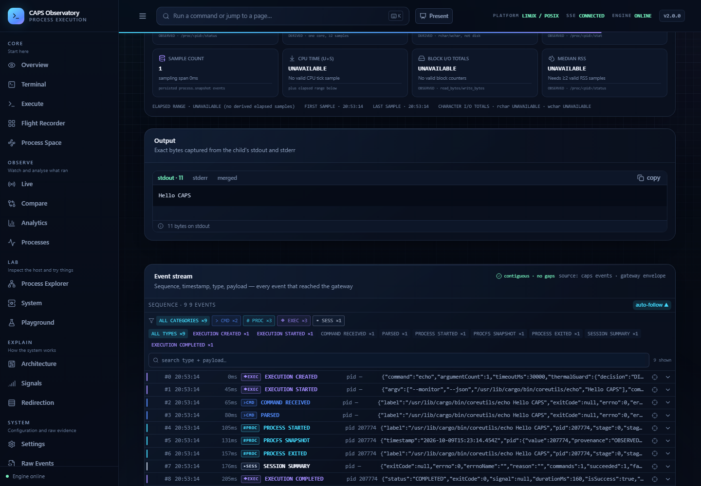 |
| Live process evidence | 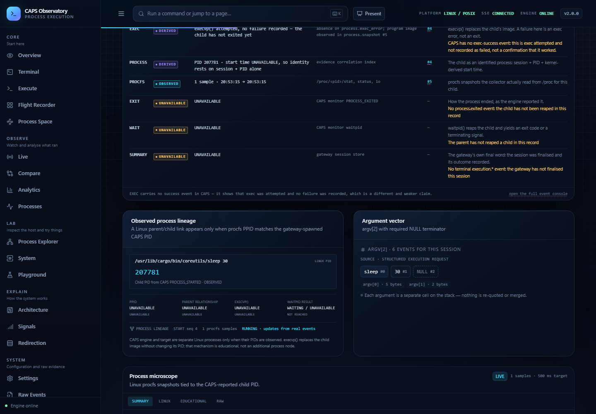 |
| Process Space | 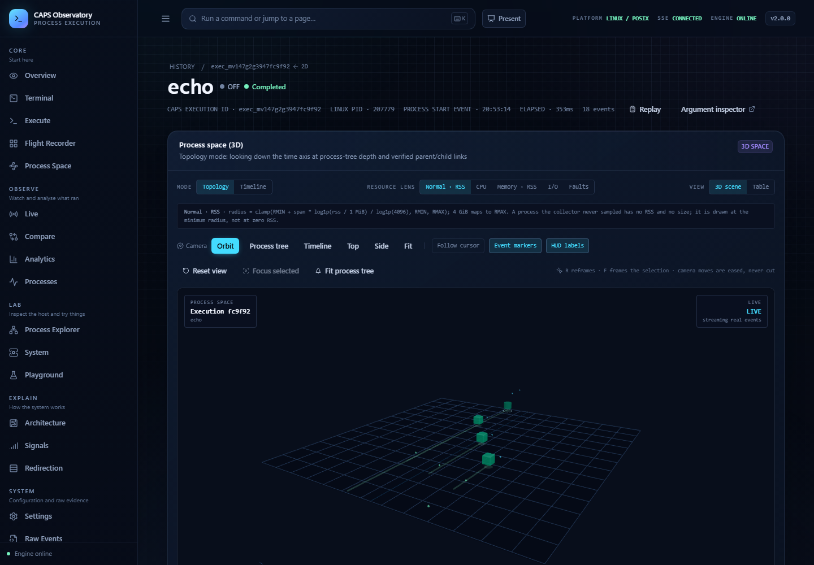 |
| Selected process | 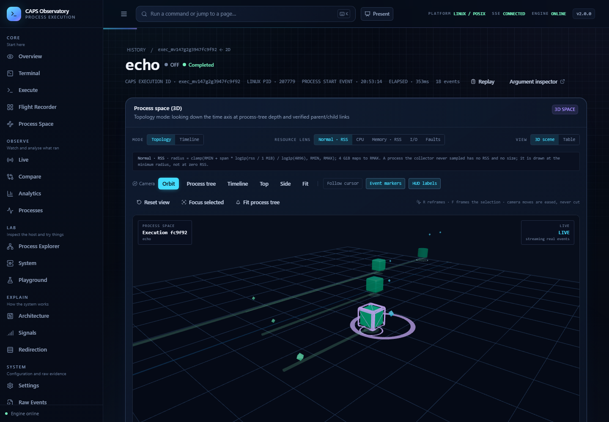 |
| Timeline camera | 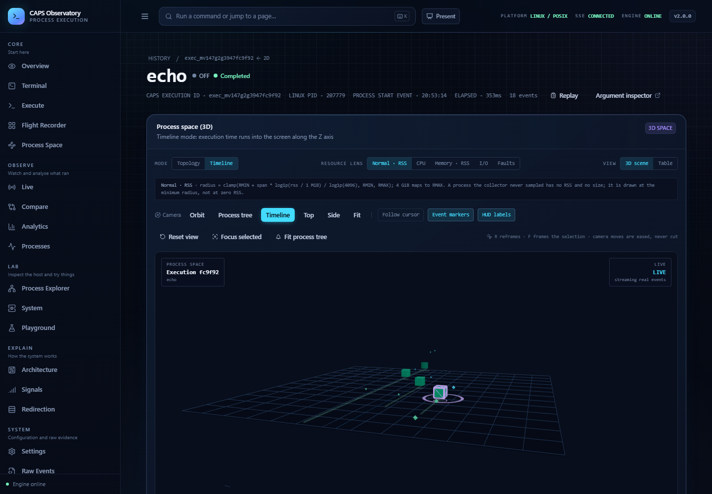 |
| Selected event and cursor | 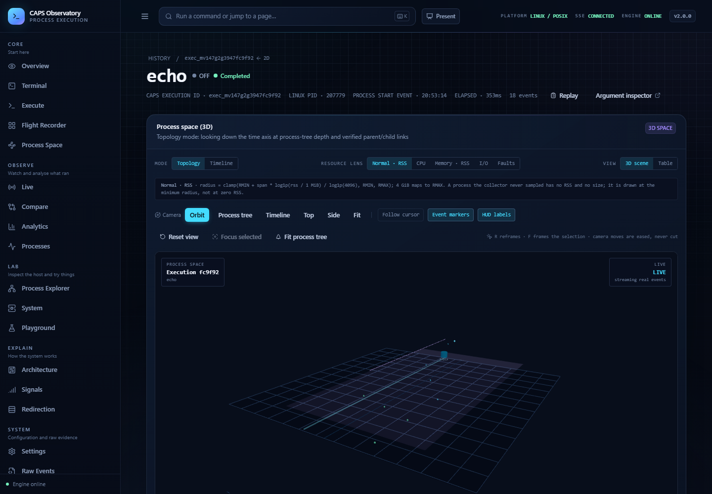 |
| Accessible process table | 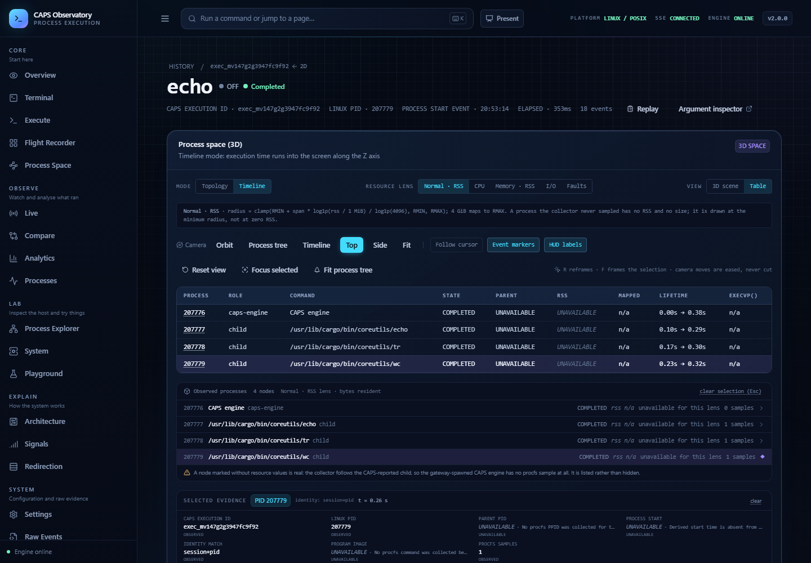 |
| History | 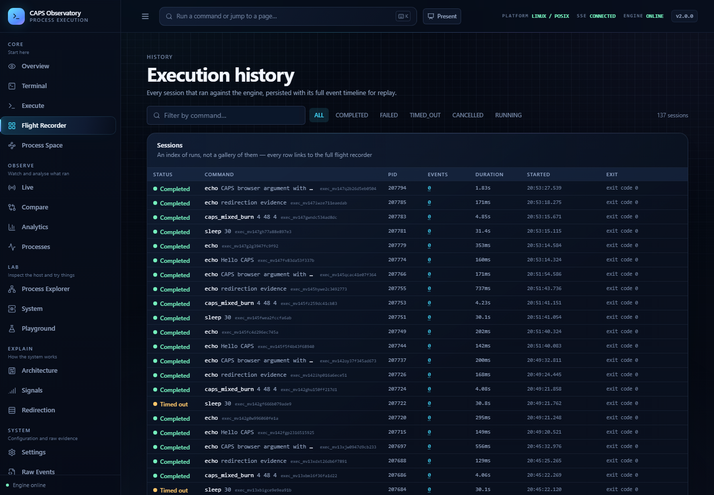 |
| Live observatory | 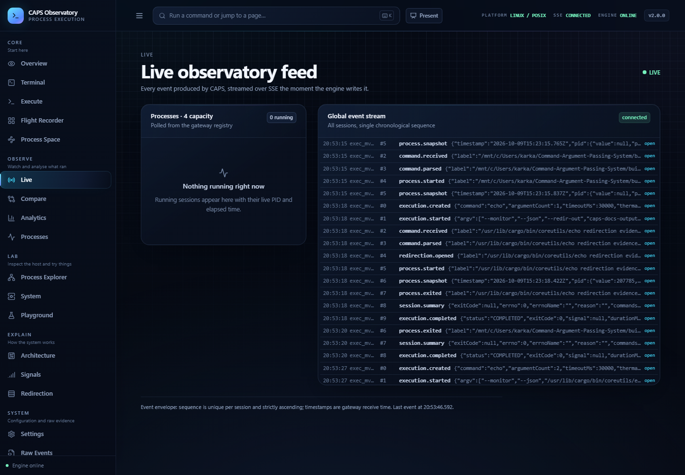 |
| Analytics | 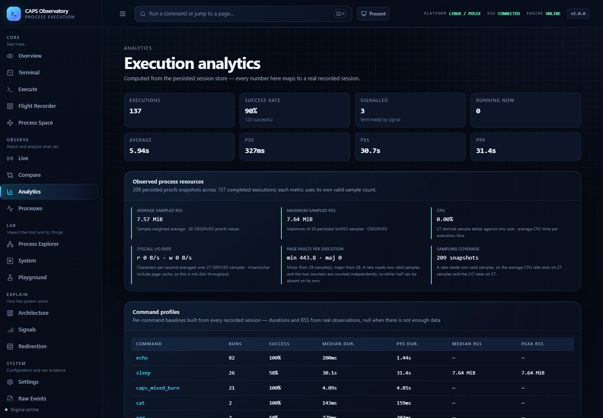 |
| Mobile overview | 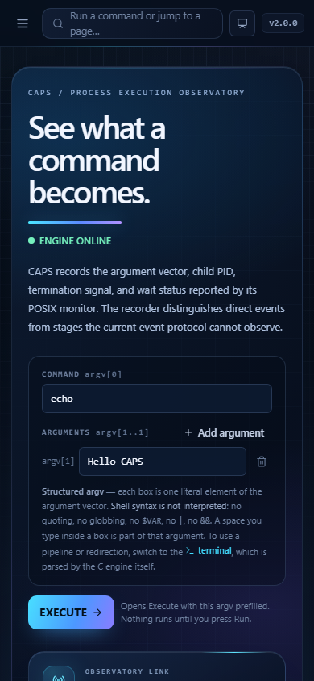 |
| Mobile navigation | 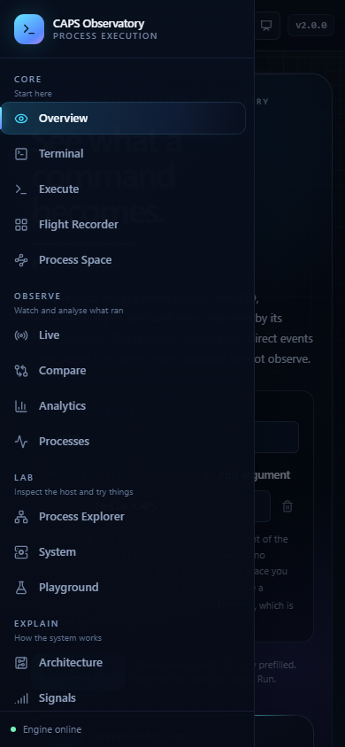 |

The capture directory also contains the top camera preset, argument inspector, process explorer,
system, compare, signals, redirection, architecture, settings, demo, playground,
raw-event, and about routes. The full set is retained at
[`docs/screenshots/motion-finish-2026-10-09/`](docs/screenshots/motion-finish-2026-10-09/).


1. Open **Execute** (`E`). Run `echo Hello CAPS`.
2. The Flight Recorder opens. Find `process.started` — that is the real `fork()`.
3. Look at the PID and the observed PPID in the process inspector.
4. Open **Live telemetry** to see `OBSERVED` procfs values for that PID.
5. Move the **shared cursor** across the timeline. Every synchronized surface
   follows it.
6. Click a **process**, then click an **event**. The selection is scoped to this
   execution only.
7. Open the **3D Process Space**. Switch the lens: CPU → Memory → I/O → Faults.
8. Enter **replay**. Scrub, then jump to the end.
9. Switch between 3D and 2D **without leaving replay** — the selection, the
   cursor, and the lens are identical in both.
10. Download the **JSON export**, the **CSV export**, or the **Markdown report**.
    Each includes the event-stream integrity report.

### Advanced: real telemetry from real workloads

```bash
caps_cpu_burn 10       # CPU time and derived CPU% rise together
caps_memory_burn 5 64  # RSS tracks the mapping; minor faults spike on first touch
caps_io_burn 5 8       # rchar/wchar move; block counters legitimately stay near 0
caps_mixed_burn 5 64 8 # all three signals on one PID, on one timeline
caps_fork_tree 8 2     # fork activity of ONE tracked process (see the lab section)
```

Each is bounded and self-cleaning. `caps_io_burn` creates and removes its own
private workspace on every exit path, including signal delivery.

## 3–5 minute demo

1. Open **Execute** (`E`). Run `echo Hello CAPS`.
2. The Flight Recorder opens. Find `process.started` — that is the real `fork()`.
3. Look at the PID and the observed PPID in the process inspector.
4. Open the live telemetry panel to see `OBSERVED` procfs values for that PID.
5. Move the **shared cursor** across the timeline. Every synchronized surface
   follows it.
6. Click a **process**, then click an **event**. The selection is scoped to this
   execution only.
7. Open the **3D Process Space**. Switch the lens: CPU → Memory → I/O → Faults.
8. Enter **replay**. Scrub, then jump to the end.
9. Switch between 3D and 2D **without leaving replay** — the selection, the
   cursor, and the lens are identical in both.
10. Download the **JSON export**, the **CSV export**, or the **Markdown report**.
    Each includes the event-stream integrity report.

### Advanced: real telemetry from real workloads

```bash
caps_cpu_burn 10       # CPU time and derived CPU% rise together
caps_memory_burn 5 64  # RSS tracks the mapping; minor faults spike on first touch
caps_io_burn 5 8       # rchar/wchar move; block counters legitimately stay near 0
caps_mixed_burn 5 64 8 # all three signals on one PID, on one timeline
caps_fork_tree 8 2     # fork activity of ONE tracked process (see the lab section)
```

Each is bounded and self-cleaning. `caps_io_burn` creates and removes its own
private workspace on every exit path, including signal delivery.
## Verification (v2.0.0 historical baseline)

Every number above is from an actual run on WSL2 Ubuntu with gcc and Node 22.14.
The complete run, including the release blockers that were found and fixed and
what was **not** run and why, is in
[docs/audit/RELEASE_VERIFICATION_2_0_0.md](docs/audit/RELEASE_VERIFICATION_2_0_0.md).

| Verification | Result | How |
| --- | --- | --- |
| GCC strict build (`-Werror`) | PASS | `make CC=gcc CFLAGS="-std=c11 -Wall -Wextra -Wpedantic -Werror -g"` |
| Clang strict build (`-Werror`) | NOT RUN here | configured in the CI matrix; clang is not installed on this machine |
| C unit + integration suite | PASS | `make test` — **16 suites, 260 assertions** |
| C ASan + UBSan (leak detection) | PASS | `make test-asan` — the same 16 suites, 260 assertions |
| Controlled workload suite | PASS | `make test-workloads` |
| Workload sanitizers | PASS | `make test-workloads-asan` |
| Backend typecheck + build | PASS | `npm run typecheck && npm run build` |
| Backend tests | PASS | **450 tests**, 27 files — `node node_modules/vitest/vitest.mjs run` |
| Frontend typecheck + production build | PASS | `npm run typecheck && npm run build` |
| Frontend tests | PASS | **247 tests**, 13 files |
| Real gateway integration (real engine, real workloads) | PASS | `web/backend/tests/api/server.test.ts` — 32 tests |
| Catalog schema vs the real program interface | PASS | `web/backend/tests/unit/catalogSchema.test.ts` |
| stderr redirection: capability matches both routes | PASS | `web/backend/tests/api/stderrRedirection.test.ts` |
| Pipeline stage accounting (I11, I14) | PASS | `web/backend/tests/api/pipeline.test.ts`, `tests/test_pipeline.sh` |
| CAPS-owned attribution, end to end | PASS | `web/backend/tests/api/ownership.test.ts` |
| pidfd identity (incl. a real zombie) | PASS | `tests/test_pidfd.sh` |
| Resource limits reach the child | PASS | `tests/test_limits.sh` |
| Thermal guard decisions | PASS | `web/backend/tests/unit/thermalGuard.test.ts`, `thermalGuardConfig.test.ts` |
| Thermal guard on the real execution path (refuses, records, admits) | PASS | `web/backend/tests/unit/thermalAdmission.test.ts` |
| Pipeline stages receive the configured resource limits | PASS | `tests/test_limits.sh` - per-stage `/proc/<pid>/limits` |
| Child signal model is stated, not inherited (SIGINT + SIGPIPE) | PASS | `tests/test_pipeline.sh`, `tests/test_signals.sh` |
| Failure injection | PASS | `tests/unit/failureInjection.test.ts` |
| Ground truth vs raw `/proc` | PASS | [docs/ground-truth-verification.md](docs/ground-truth-verification.md) — **59 checks** |
| Catalog examples through the engine lexer | PASS | 40 of 40 |
| Cross-view consistency (one real execution, 17 assertions) | PASS | `scripts/cross-view-proof.sh`; trace in [docs/cross-view-trace.md](docs/cross-view-trace.md) |
| Cross-view correlation (2D ≡ 3D) | PASS | `web/frontend/src/lib/hardening.test.ts` |
| SSE resume, race-free delivery, no synthetic sequence | PASS | `scripts/browser-smoke.sh` — 15 assertions |
| WebGL / 2D / table fallbacks | PASS | `web/frontend/src/components/space/SpaceErrorBoundary.tsx` |
| Repository hygiene (no artifacts, secrets, local paths) | PASS | `scripts/check-repository-hygiene.sh` |
| Documentation links | PASS | `scripts/check-docs.sh` |
| Version consistency + the gate's own self-test | PASS | `scripts/check-version.sh`, `scripts/check-version.test.sh` |
| Commit attribution integrity | PASS | `scripts/check-attribution.sh` |
| Visual-regression (pixel diff) | NOT APPLICABLE | no such system exists in this repository and none is claimed |

CI runs all of the above on every pull request, plus a browser smoke suite
against the production build and a CodeQL scan of the C and TypeScript.
See [`.github/workflows/ci.yml`](.github/workflows/ci.yml).

The current CAPS 3.0 candidate verification, including this host's Linux and
browser limitations, is recorded separately in
[docs/audit/CAPS_3_RELEASE_VERIFICATION.md](docs/audit/CAPS_3_RELEASE_VERIFICATION.md).

> **There is no visual-regression (pixel-diff) suite.** The repository has no
> visual-diff infrastructure and this milestone did not invent one: a
> screenshot-diff system tests pixels rather than behaviour. The browser smoke
> suite is behavioural — route loading, a real execution, the event stream,
> replay, and the fallback path.

## Performance

Measured on this machine (WSL2, Node 22.14, SQLite via `node:sqlite`) with
`web/backend/scripts/benchmark.ts`. These are measurements to compare against
after a change, not targets.

| Events stored | Insert (µs/event) | Replay load (µs/event) | Invariant check | Analytics aggregate | 3D view-model build | Store size |
| --- | --- | --- | --- | --- | --- | --- |
| 100 | 14.1 | 12.9 | 0.8 ms | 1.5 ms | 1.2 ms | 0.2 MiB |
| 1 000 | 9.2 | 9.8 | 0.8 ms | 7.6 ms | 2.0 ms | 1.1 MiB |
| 10 000 | 12.3 | 15.8 | 13.6 ms | 82.4 ms | 34.7 ms | 10.9 MiB |
| 100 000 | 11.6 | 24.7 | 268.9 ms | 1 101.5 ms | 150.2 ms | 108.7 MiB |

The property that matters for a recorder is that the **per-event** cost does
not grow with history: insert cost is flat (0.8× from 100 to 100 000 events)
and replay load grows only 1.9× across three orders of magnitude. Reproduce
with `cd web/backend && npx tsx scripts/benchmark.ts`.

The analytics aggregate is linear in stored snapshots, which is why retention
exists rather than being optional polish.

## Technology stack

| Layer | Technology |
| --- | --- |
| Engine | C11, POSIX (`fork`, `execvp`, `waitpid`, `sigaction`, `openat`), Linux `/proc` |
| Gateway | Node.js 22, TypeScript, Fastify 5, Zod, `node:sqlite` (WAL, versioned migrations) |
| Transport | Server-Sent Events over HTTP |
| Frontend | React 19, TypeScript, Vite 6, Tailwind CSS v4, Motion, Recharts |
| 3D | Three.js, React Three Fiber, Drei |
| State | Zustand (UI state, session-scoped investigation selection) |
| Testing | Vitest, Testing Library, shell harnesses, Playwright-free browser smoke, ASan/UBSan, GCC + Clang |
| CI | GitHub Actions, CodeQL, Dependabot |

Every entry is in a `package.json`, the `Makefile`, or a `.github/workflows`
file. Nothing here is aspirational.

## Project structure

```
Command-Argument-Passing-System/
├── src/                       C engine
│   ├── main.c                 REPL and one-shot entry, signal init
│   ├── process.c              fork / execvp / waitpid, redirection, lifecycle events
│   ├── parser.c               argv tokenization, redirection split
│   ├── monitor.c              event formatting (text and JSON), session summary
│   ├── signals.c              SIGINT model
│   └── builtin.c              help / cd / exit
├── include/                   engine headers (version.h is generated)
├── workloads/                 five bounded first-party laboratory programs
├── tests/                     C suites + the waitpid failure probe
├── scripts/                   CI verification scripts, version generator, smoke suite
├── web/
│   ├── backend/
│   │   ├── src/
│   │   │   ├── analytics/     percentiles, peaks, comparison
│   │   │   ├── api/           REST + SSE route wiring
│   │   │   ├── config/        validated configuration and the bind boundary
│   │   │   ├── db/            migrations, transactions, repositories
│   │   │   ├── events/        bus, SSE, event-stream invariants
│   │   │   ├── execution/     runner, registry, terminator, normalizer, output
│   │   │   ├── security/      allowlist, executable resolution, path policy
│   │   │   ├── telemetry/     procfs collector, sampler, provenance, capabilities
│   │   │   └── types/         the canonical event contract
│   │   ├── scripts/benchmark.ts
│   │   └── tests/             unit + integration
│   └── frontend/
│       └── src/
│           ├── api/           REST client (timeout + abort) and SSE hooks
│           ├── components/    execution/, layout/, space/ (3D observatory)
│           ├── lib/           pure view-models and evidence correlation
│           ├── pages/         one page per workspace
│           └── store/         Zustand: ui + session-scoped investigation
├── docs/                      the documentation set (index below)
└── scripts/check-*.sh         repository verification
```

## Limitations

Full detail, with the reason for each, in
**[docs/limitations.md](docs/limitations.md)**. The headline boundaries:

* **No shell.** There is no `sh -c`, no glob expansion, no `$VAR`, no command
  substitution, no `&&`/`||`/`;` chaining, and no heredocs. The **execution path**
  uses exactly one lexer — `parser_tokenize()` in the C engine — and the browser
  and gateway both call it rather than re-implementing it. Two lexers eventually
  disagree about one quoting case, always in the unsafe direction. Quoting and
  backslash escapes *are* honoured by that lexer; what is missing is shell
  expansion, not tokenisation. A second, legacy whitespace-only split
  (`parser_parse()`) survives only behind `caps --parse`, which is a debug view of
  a simpler split and is never what actually runs.
* **Not every Linux command.** Only an explicit allowlist with per-command
  argument schemas. Unknown commands are refused with a reason.
* **Pipelines are `|`-only.** No `&&`, no `||`, no `;` chaining, no heredocs.
  Stderr redirection *is* supported, on either side of a stage: `2> file`
  truncates and `2>> file` appends, and each applies to the stage it is written
  on. See [docs/redirection.md](docs/redirection.md).
* **`du` takes files, not directories.** The workspace policy admits regular
  files only, so `du .` is refused even though `du` normally defaults to the
  current directory. Permitting it would open directory traversal on the host
  filesystem.
* **No per-process network I/O.** Linux publishes no per-process byte counters in
  procfs. Host interface counters are reported; per-process attribution is not
  attempted, because any figure would be a model rather than a measurement.
* **Execution-scoped telemetry follows CAPS-reported processes.** A command has
  one direct child; a pipeline has one direct child per stage. Each is sampled
  independently. A program's own descendants are not discovered. The **host**
  inventory is separate and builds a best-effort parent/child tree.
* **Linux only.** The engine is POSIX; the telemetry is `/proc` and `/sys`. On any
  other platform the gateway reports telemetry as unavailable rather than
  inventing values.
* **Single-node.** One host, no distributed ingestion, no multi-host aggregation.
* **No eBPF, syscall tracing, cgroup accounting, tracepoints, or GPU telemetry.**
  Kernel-exposed procfs counters only.
* **Loopback security boundary.** Safe for a single user on one machine. No
  multi-tenant model, no RBAC, no per-user isolation. A confined workspace is not
  a privilege boundary: there are no namespaces, seccomp, or cgroups.
* **`kill`, `pkill`, and `killall` are refused.** They can reach processes CAPS
  does not own. CAPS signals only what it started. The kernel identity is
  captured at spawn and re-verified before every *delayed* escalation and for
  every `pidfd` signal; the first signal of a terminate or timeout goes to the
  PID the gateway itself just forked and has not reaped, which cannot have been
  recycled. See [SECURITY.md](SECURITY.md).
* **3D requires WebGL**, with functional 2D and table fallbacks that are less
  dense visually.
* **No pixel-diff verification.** The browser suite asserts behaviour, not
  pixels. See [docs/testing.md](docs/testing.md).
* **WSL2 is verified, bare Windows is not** — and WSL2 is a guest, so its
  `/proc` figures describe the guest kernel, not physical hardware. CPU frequency
  is typically `UNAVAILABLE` there, and thermal discovery depends on what the
  guest exposes.
* **Clang is verified in CI, not locally.** The development environment used for
  this release has no Clang and no package-installation rights. The local run is
  GCC with `-Werror` plus ASan/UBSan.

## Future scope

**Implemented** — the full lifecycle, real procfs telemetry, canonical event
persistence, race-free SSE, read-only replay, the identity model, cross-view
correlation, 2D and 3D investigation, analytics/comparison/export, the workload
lab, and the security boundary described above.

**Partially implemented** — retention (configurable, swept on an interval, no
UI surface yet); 3D scene density at very large event counts; the
`caps_fork_tree` topology, which exists in the kernel but is not observed by
the gateway.

**Planned, not implemented** — descendant process observation; pipe and IPC
visualization; syscall-level tracing; eBPF; cgroup and container awareness;
larger-trace virtualization in the event list; production-grade remote
authentication; distributed trace ingestion.

Nothing on the planned list is claimed anywhere else in this repository.

## Documentation

| Document | What it answers |
| --- | --- |
| [SECURITY.md](SECURITY.md) | The threat model, what is enforced, and what is out of scope |
| [CONTRIBUTING.md](CONTRIBUTING.md) | How to build, verify, and the authorship policy |
| [CHANGELOG.md](CHANGELOG.md) | What was built, in order |
| [docs/limitations.md](docs/limitations.md) | **What CAPS does not do** — read this before assuming coverage |
| [docs/architecture.md](docs/architecture.md) | The reference: pipeline, boundaries, invariants, lifecycle |
| [docs/observability-model.md](docs/observability-model.md) | What is observed, what is not, and provenance |
| [docs/host-telemetry.md](docs/host-telemetry.md) | Every host metric, its kernel source, and its provenance |
| [docs/guardrails.md](docs/guardrails.md) | What is enforced, by which layer, and what is not |
| [docs/web-architecture.md](docs/web-architecture.md) | Gateway module layout, event model, storage |
| [docs/web-api.md](docs/web-api.md) | Endpoint reference |
| [docs/telemetry.md](docs/telemetry.md) | Per-execution telemetry for CAPS-owned children |
| [docs/monitor.md](docs/monitor.md) | The C monitor protocol and its event types |
| [docs/process-lifecycle.md](docs/process-lifecycle.md) | `fork`/`exec`/`wait` semantics as CAPS implements them |
| [docs/process-microscope.md](docs/process-microscope.md) | Per-process telemetry and identity verification |
| [docs/signals.md](docs/signals.md) | The signal model and its fail-closed policy |
| [docs/redirection.md](docs/redirection.md) | Descriptor lifecycle and the `O_NOFOLLOW` policy |
| [docs/three-dimensional-observatory.md](docs/three-dimensional-observatory.md) | The 3D scene, its coordinate semantics, and its fallbacks |
| [docs/realtime-visualization.md](docs/realtime-visualization.md) | The shared cursor and cross-view synchronization |
| [docs/workload-lab.md](docs/workload-lab.md) | Each workload, its bounds, and what it demonstrates |
| [docs/testing.md](docs/testing.md) | Every verification command, and what runs where |
| [docs/design-system.md](docs/design-system.md) | Palette, typography, layered surfaces, motion, and responsive behavior |
| [docs/ground-truth-verification.md](docs/ground-truth-verification.md) | **Every figure compared against the raw kernel file it claims to come from** |
| [docs/cross-view-trace.md](docs/cross-view-trace.md) | **A recorded trace of one execution through every surface** |
| [docs/runtime-verification.md](docs/runtime-verification.md) | How to verify a running instance by hand |
| [docs/faculty-demo.md](docs/faculty-demo.md) | A guided demonstration script |
| [docs/development-phases.md](docs/development-phases.md) | Historical: how the project was built up |
| [docs/audit/](docs/audit/) | **[RELEASE_VERIFICATION_2_0_0.md](docs/audit/RELEASE_VERIFICATION_2_0_0.md) is the authoritative verification record for 2.0.0**, including what was NOT run and why. The sibling files — `FINAL_REPOSITORY_AUDIT.md`, `FINAL_RELEASE_VERIFICATION.md`, `GIT_ATTRIBUTION_CLEANUP.md` — are historical 1.1.0 records, each carrying a banner saying so. |

## Contributing

See [CONTRIBUTING.md](CONTRIBUTING.md). Short version: `make && make test`,
then the two `npm ci && npm run typecheck && npm run build && npx vitest run`
pairs. AI tooling must never be recorded as a Git contributor; the
`attribution` CI job enforces it.

## License

MIT — see [LICENSE](LICENSE).
