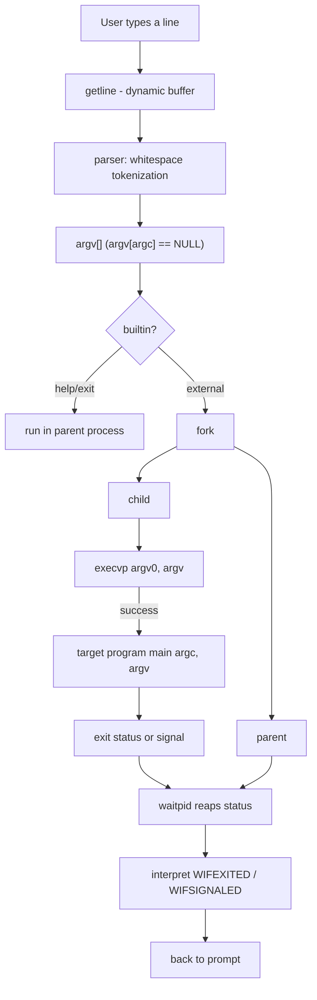

# Architecture

Status: **Approved baseline** (Phase 0)

This document describes the intended module layout, the data flow
through the system, and the build/test structure of the Command
Argument Passing System (`caps`).

---

## 1. Top-level layout

```text
Command-Argument-Passing-System/
├── src/          C source files (one module per file)
├── include/      public headers for the modules
├── tests/        automated test scripts
├── docs/         design documentation (this directory)
├── examples/     sample sessions and expected outputs
├── Makefile      build, clean, test, run targets
├── .gitignore    build artifacts and junk exclusions
├── LICENSE
├── README.md
└── ABSTRACT.docx
```

> This is the *target* structure. Files appear only when the
> corresponding functionality is introduced.

---

## 2. Module map (target)

```text
src/main.c        main() — banner, REPL loop, dispatch
src/parser.c      tokenization of a command line into argv
src/executor.c    run one argv[]: builtin check + external launch
src/process.c     raw fork()/execvp()/waitpid() lifecycle
src/builtin.c     help, exit (later: cd)
src/signals.c     parent SIGINT/child dispositions (Phase 7)
src/utils.c       shared helpers (error reporting, strdup, freeing)
```

Each module has a matching header in `include/`.

Dependency direction is strict: `main -> executor -> process`,
`main -> parser`, `main -> builtin`. Lower layers never call the REPL.

---

## 3. Data flow (normative)



Read in words:

1. **Read** a whole line with `getline()` (dynamic, no fixed buffer).
2. **Parse** into tokens: `["cmd", "arg1", ..., NULL]`.
3. **Dispatch**: built-ins run in the parent; everything else is
   launched as an external process.
4. **External command**: the parent `fork()`s. The child calls
   `execvp()`, which replaces the child's memory image with the target
   program. The parent calls `waitpid()` and blocks until the child
   exits.
5. **Status**: the parent interprets the raw wait status and reports
   only what is useful; then the prompt returns.

---

## 4. The core cycle

The educational heart of the project:

```text
command line
    |
    v
argv[]   (parser guarantees NULL terminator)
    |
    v
fork() ----------+
    |            |
(parent)      (child)
    |            |
waitpid()    execvp()
    |            |
    v            v
status    target program (same PID as child)
    |
    v
interpret: exit code | signal
```

Why `fork` then `exec` instead of a direct `exec`?

- `execvp()` *replaces* the calling process. If `caps` exec'd directly,
  the interactive runner would vanish.
- `fork()` clones the runner; the clone (`child`) is the one replaced
  by `execvp()`. The original runner (`parent`) keeps executing, so it
  can continue the REPL after the child finishes.
- `waitpid()` gives the parent a rendezvous point: it suspends until
  the child has terminated and lets the parent read the exit outcome.

---

## 5. Module responsibilities

### 5.1 parser

Input: a line `"echo Hello World\n"`.
Output: `{"echo", "Hello", "World", NULL}` and `argc == 3`.

Guarantees:

- tokens are `malloc`'d copies owned by the caller;
- `argv[argc] == NULL` always;
- leading/trailing/repeated spaces and empty input are handled.

Limitations (documented, not hidden):

- no quotes, escapes, globs, vars, pipes, redirection (initial parser).

### 5.2 executor

Takes a parsed `argv[]`, decides built-in vs external, runs it,
reports results, and frees parsed memory.

### 5.3 process

The only module that calls `fork()`, `execvp()`, and `waitpid()`.
Keeps the unsafe low-level lifecycle in one place so the rest of the
code cannot mishandle child processes.

Child contract:

- on `execvp()` failure the child prints an error and `_exit()`s; it
  never returns into the parent's control flow.

Parent contract:

- checks `fork()` return; reports `-1` as a fatal-per-command error;
- `waitpid(pid, &status, 0)` returns the PID on success, `-1` (with
  errno) on failure.

### 5.4 builtin

Implemented in the parent process only.

- `help` — prints supported commands.
- `exit` — signals termination of the REPL.
- (later) `cd` — would call `chdir()` in the parent, because the child
  process cannot change the parent's working directory.

### 5.5 utils

Shared helpers: prefix error printing (`caps: ...`), safe string
duplication, freeing an `argv[]`.

---

## 6. Errors and recovery

| Failure               | Module     | Behavior                                     | REPL continues? |
| --------------------- | ---------- | -------------------------------------------- | --------------- |
| empty/whitespace line | main/parser| ignored silently                              | yes             |
| unknown command       | process    | `caps: command not found: <cmd>`              | yes             |
| `fork()` -1           | process    | `caps: fork: <strerror(errno)>`               | yes             |
| `execvp()` fails      | process    | `caps: <cmd>: <strerror(errno)>` then `_exit()`| parent: yes    |
| `waitpid()` -1        | process    | `caps: waitpid: <strerror(errno)>`            | yes             |
| EOF at prompt         | main       | newline + clean exit 0                        | ends            |

Rule: only `help`/`exit`/EOF end the REPL; no single command failure
may kill the runner.

---

## 7. Build design (Makefile)

Variables: `CC`, `CFLAGS`, `CPPFLAGS`, `LDFLAGS`.

```make
CFLAGS  := -std=c11 -Wall -Wextra -Wpedantic -g
```

Targets:

| Target       | Purpose                                    |
| ------------ | ------------------------------------------ |
| `caps`       | default; linked from `src/*.c`             |
| `clean`      | remove objects and binary                  |
| `test`       | run `tests/` suite against fresh build     |
| `run`        | launch `./caps`                            |
| `debug`      | build with sanitizer-enabled flags (Phase 1) |

No third-party build tools; plain GNU Make.

---

## 8. Test design

`tests/` contains POSIX-shell scripts, each testing one concern:

```text
test_parser.sh       tokenizer behavior (empty, whitespace, args)
test_execution.sh    valid commands + arguments + options
test_errors.sh       unknown command, fork/exec/wait failure paths
test_exit_status.sh  exit 0, non-zero, signal termination
```

Rationale: the app is an interactive REPL, so behavioral tests pipe
scripted input into `./caps` and assert on stdout/stderr — no
test-framework dependency on the target machines. Controlled C helper
programs (e.g. one that raises a signal) are compiled by the harness
for deterministic status tests.

`make test` uses a *fresh* temporary build in a scratch directory so
the checked-in tree stays clean.

---

## 9. Invocation contracts (target)

### Interactive

```text
caps> <line>
```

### One-shot (Phase 2/3)

```text
caps <command> [arg ...]
```

executes once in `fork`/`execvp`/`waitpid` fashion and exits,
propagating child status to `caps`' own exit status.

### Debug mode

`caps --debug` prints per-step traces:

```text
[parent] forked child pid=12345
[child] execvp echo
[parent] child 12345 exited with status 0
```

Normal mode stays quiet.

---

## 10. Design decisions (why)

| Decision                        | Rationale                                        |
| ------------------------------- | ------------------------------------------------ |
| `getline()` not `fgets()`       | dynamic sizing; no arbitrary line-length limit   |
| `execvp()` over `execve()`      | PATH search; no env plumbing needed here         |
| `fork()` rather than `system()` | explicit process model, the project's purpose    |
| `waitpid(pid,...)` not `wait()` | unambiguous relation to the exact child          |
| `_exit()` in child after failed exec | skips stdio flushing that would duplicate parent buffers; async-signal-safe execution context |
| modules introduced per phase    | complexity appears incrementally; clarity first  |