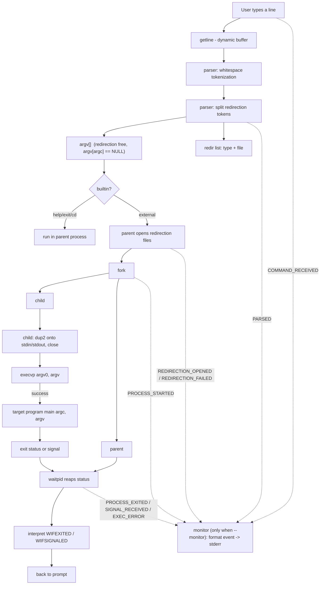

# Architecture

Status: **Approved baseline** (Phase 0), updated through **Phase 11**
(real-time execution monitoring)

This document describes the module layout, the data flow through the
system, and the build/test structure of the Command Argument Passing
System (`caps`) as implemented.

---

## 1. Top-level layout

```text
Command-Argument-Passing-System/
├── src/          C source files (one module per file)
├── include/      public headers for the modules
├── tests/        automated test scripts
├── docs/         design documentation (this directory)
├── Makefile      build, clean, test, run targets
├── .gitignore    build artifacts and junk exclusions
├── .gitattributes LF normalization for text files
├── LICENSE
├── README.md
└── ABSTRACT.docx
```

> All entries above exist in the current checkout. An `examples/`
> directory is not created; sample sessions are documented in
> `README.md` instead.

---

## 2. Module map

```text
src/main.c        main() — banner, REPL loop, dispatch
src/parser.c      tokenization of a command line into argv;
                  extraction of redirection tokens (> >> <)
src/process.c     fork()/execvp()/waitpid() lifecycle;
                  redirection open()/dup2()/close()
src/builtin.c     help, exit, cd (run in the parent process)
src/signals.c     parent SIGINT/child dispositions
src/monitor.c     real-time lifecycle event formatting (text / JSON)
src/utils.c       caps-prefixed stderr error reporting (caps_error)
```

Each module has a matching header in `include/`.

Dependency direction is strict: `main -> process`, `main -> parser`,
`main -> builtin`, `main -> signals`, `main -> monitor`; `process`
depends on `monitor` (to emit events) and on `signals` (to reset child
dispositions). Lower layers never call the REPL, and the monitor never
calls back into execution — it is a write-only observer.

---

## 3. Data flow (normative)



Read in words:

1. **Read** a whole line with `getline()` (dynamic, no fixed buffer).
2. **Parse** into tokens: `["cmd", "arg1", ..., NULL]`.
3. **Split redirection**: a token that is exactly `<`, `>` or `>>`
   consumes the following token as its file; both move into a
   redirection list that travels beside `argv[]`.
4. **Dispatch**: built-ins run in the parent; everything else is
   launched as an external process.
5. **External command**: the parent opens every redirection file first
   (a failure — missing input, unwritable target — aborts the command
   before any process is created), then `fork()`s. The child `dup2()`s
   the descriptors onto stdin/stdout, closes the originals, and calls
   `execvp()`, which replaces the child's memory image with the target
   program. The parent closes its copies and calls `waitpid()`, blocking
   until the child exits.
6. **Status**: the parent interprets the raw wait status and reports
   only what is useful; then the prompt returns.
7. **Monitor (optional)**: when `--monitor` is active, the execution
   core emits each event (received, parsed, redirection, started,
   exited/signal/exec-error) *at the moment it occurs*. The monitor
   formats and writes it to stderr immediately; it never buffers a
   whole run, never influences execution, and is absent (a `NULL`
   pointer) in normal builds.

---

## 4. The core cycle

The educational heart of the project:

```text
command line
    |
    v
argv[]   (parser guarantees NULL terminator)
    |
    v
fork() ----------+
    |            |
(parent)      (child)
    |            |
waitpid()    execvp()
    |            |
    v            v
status    target program (same PID as child)
    |
    v
interpret: exit code | signal
```

Why `fork` then `exec` instead of a direct `exec`?

- `execvp()` *replaces* the calling process. If `caps` exec'd directly,
  the interactive runner would vanish.
- `fork()` clones the runner; the clone (`child`) is the one replaced
  by `execvp()`. The original runner (`parent`) keeps executing, so it
  can continue the REPL after the child finishes.
- `waitpid()` gives the parent a rendezvous point: it suspends until
  the child has terminated and lets the parent read the exit outcome.

---

## 5. Module responsibilities

### 5.1 parser

Input: a line `"echo Hello World\n"`.
Output: `{"echo", "Hello", "World", NULL}` and `argc == 3`.

Guarantees:

- tokens are `malloc`'d copies owned by the caller;
- `argv[argc] == NULL` always;
- leading/trailing/repeated spaces and empty input are handled.

Limitations (documented, not hidden):

- no quotes, escapes, globs, vars, or pipes;
- redirection supported in the interactive REPL only (`>`, `>>`, `<`
  as whole tokens); one-shot mode treats `>` as a literal argument.
- an operator is recognized only as a whitespace-separated token:
  `echo hi > f` and `echo hi >f` differ (`>f` is a literal argument,
  because the tokenizer never splits inside a word and the operator
  must equal exactly `>` / `>>` / `<`).

Redirection split contract: validation happens before any token is
removed, so a malformed line (a redirection that is the last token)
leaves the original argv untouched and is reported as a syntax error.
The file token's ownership is *transferred* into the redirection list;
operator tokens are freed; `argv[argc] == NULL` is re-established.
Multiple redirections are allowed and are applied in the order the
file tokens appeared on the line (see `docs/redirection.md §5.1`).

### 5.2 process

The only module that calls `fork()`, `execvp()`, and `waitpid()`, and
the only module that manipulates file descriptors for redirection
(`open()`, `dup2()`, `close()`). Keeps the unsafe low-level lifecycle
in one place so the rest of the code cannot mishandle child processes.

Redirection lifecycle (all inside process_exec):

1. parent opens each file (`O_RDONLY | O_WRONLY|O_CREAT|O_TRUNC |
   O_WRONLY|O_CREAT|O_APPEND`); on any failure the command is aborted,
   the already-opened descriptors are closed, and the REPL continues;
2. `fork()`;
3. child: for each descriptor, if `fd == target` (the standard slot was
   closed, so `open()` handed back that very fd) keep it as-is;
   otherwise `dup2()` it onto stdin/stdout and close the original; exec;
4. parent: close its copies (open files are inherited by the child, not
   shared state after fork), then `waitpid()`.

Descriptor ownership rule (Step 3): `open()` returns the *lowest* free
slot, so when stdin/stdout were closed it can legitimately return `0`
or `1`. `dup2(fd, fd)` is a no-op, and the trailing `close(fd)` would
then close the descriptor that was just installed — the exact failure
this code avoids by skipping that descriptor. This is the closed-fd
edge case covered by `tests/test_fd_edge.sh`.

`close()` policy: closing the parent's copies is best-effort
(`(void)close(...)`). By then fork has succeeded and the child owns the
files, so a `close()` error is not actionable; it is deliberately not
reported. An `open()` failure *is* actionable and is reported.

Child contract:

- on `execvp()` failure the child prints an error and `_exit()`s; it
  never returns into the parent's control flow.

Parent contract:

- checks `fork()` return; reports `-1` as a fatal-per-command error;
- `process_wait_child(pid, &status)`: retries only `EINTR`; any other
  `waitpid()` errno (reachably `ECHILD`, i.e. already reaped) is terminal,
  reported once, and yields a per-command failure rather than an endless
  retry or a guessed status.

### 5.4 builtin

Implemented in the parent process only.

- `help` — prints supported commands.
- `exit` — signals termination of the REPL.
- `cd` — calls `chdir()` in the parent; a child process cannot change
  the parent's working directory.

Redirection does not apply to built-ins: a built-in paired with a
redirection token is rejected with an error. (Redirecting a built-in's
output would require dup2() around the parent-side call, out of the
current scope.)

### 5.5 utils

Shared helper: `caps_error()` — `caps:`-prefixed stderr reporting, used
consistently across modules.

### 5.6 monitor

Optional, strictly observational real-time event sink (header:
`include/monitor.h`).

- `caps_monitor_create(out, json_mode)` allocates a monitor writing to
  `out`; `json_mode != 0` selects one JSON object per line, otherwise a
  human-readable line is written.
- `caps_monitor_emit(mon, ev)` formats and writes one event
  immediately; it is a no-op when `mon == NULL`, so the execution core
  can call it unconditionally and normal builds pay nothing.
- `caps_monitor_finish(mon)` writes the session summary.
- The monitor accumulates only counters for the summary; it does not
  buffer the event stream, spawn a thread, or poll.

Event types (emitted by the execution core at the instant the condition
becomes true): `COMMAND_RECEIVED`, `PARSED`, `COMMAND_PARSE_ERROR`,
`REDIRECTION_OPENED`, `REDIRECTION_FAILED`, `PROCESS_STARTED`,
`PROCESS_EXITED`, `SIGNAL_RECEIVED`, `EXEC_ERROR`, `SESSION_SUMMARY`.
Elapsed time is measured with `clock_gettime(CLOCK_MONOTONIC)` in
`process.c`; the CLI displays a wall-clock timestamp with
`CLOCK_REALTIME`. See `README.md §Real-time execution monitoring` and
`docs/monitor.md`.

---

## 6. Errors and recovery

| Failure               | Module     | Behavior                                     | REPL continues? |
| --------------------- | ---------- | -------------------------------------------- | --------------- |
| empty/whitespace line | main/parser| ignored silently                              | yes             |
| unknown command       | process    | `caps: command not found: <cmd>`              | yes             |
| redirection, bad args | parser     | `caps: syntax error: '<op>' requires a file name` | yes        |
| redirection, no cmd   | main       | `caps: syntax error: no command to redirect`  | yes             |
| redirection open() -1 | process    | `caps: <file>: <strerror(errno)>`; command aborted | yes      |
| redirection w/ builtin| main       | `caps: redirection is not supported for built-in commands` | yes |
| `fork()` -1           | process    | `caps: fork: <strerror(errno)>`               | yes             |
| `execvp()` fails      | process    | `caps: command not found: <cmd>` / `caps: <cmd>: permission denied` / `caps: <cmd>: <strerror(errno)>` then `_exit()` | parent: yes    |
| `waitpid()` -1        | process    | `caps: waitpid: <strerror(errno)>`; only `EINTR` is retried, other errnos are terminal | yes |
| `signals_parent_init()` fails | signals | `caps: sigaction(SIGINT, SIG_IGN): <strerror(errno)>`; shell continues in a degraded mode | yes     |
| `signals_child_reset()` fails | process (child) | `caps: warning: failed to reset SIGINT in child; the executed program may ignore Ctrl+C` then continues to `exec` | n/a |
| `caps_monitor_create()` fails | main | `caps: monitor setup failed`; startup aborts with `EXIT_FAILURE` | no |
| invalid `exit` argument | builtin   | `caps: exit: invalid status: '<arg>' (expected an integer in the range 0..255)`; last status set to 1 | yes |
| EOF at prompt         | main       | newline + clean exit with last status         | ends            |

Rule: only `help`/`exit`/EOF end the REPL; no single command failure
may kill the runner.

---

## 7. Build design (Makefile)

Variables: `CC`, `CFLAGS`, `CPPFLAGS`, `LDFLAGS`.

```make
CFLAGS  := -std=c11 -Wall -Wextra -Wpedantic -g
```

Targets:

| Target       | Purpose                                    |
| ------------ | ------------------------------------------ |
| `caps`       | default; linked from `src/*.c`             |
| `clean`      | remove objects and binary                  |
| `test`       | run `tests/` suite against fresh build     |
| `test-asan`  | run the suite against the ASan/UBSan build |
| `run`        | launch `./caps`                            |

No third-party build tools; plain GNU Make.

---

## 8. Test design

`tests/` contains POSIX-shell scripts, each testing one concern:

```text
test_smoke.sh        combined sanity: echo, help, cd, errors, signals
test_parser.sh       tokenizer behavior (empty, whitespace, args)
test_execution.sh    valid commands + arguments + options
test_errors.sh       unknown command, fork/exec/wait failure paths
test_exit_status.sh  exit 0, non-zero, signal termination
test_signals.sh      SIGINT/child-SIG_DFL, REPL survives child signals
test_redirection.sh  > >> <, combined <>, operator position, syntax errors,
                     missing files, unwritable targets, built-in rejection
test_exit_parse.sh   built-in `exit` argument validation (strtol, range,
                     embedded junk, overflow, REPL continuation)
test_fd_edge.sh      redirection while a standard descriptor is closed
                     (fd == target ownership edge case)
test_monitor.sh      event ordering, JSON shape, one-shot + REPL summaries
```

Rationale: the app is an interactive REPL, so behavioral tests pipe
scripted input into `./caps` and assert on stdout/stderr — no
test-framework dependency on the target machines. Controlled C helper
programs (e.g. one that raises a signal) are compiled by the harness
for deterministic status tests.

`make test` uses a *fresh* temporary build in a scratch directory so
the checked-in tree stays clean.

---

## 9. Invocation contracts

### Interactive

```text
caps> <line>
```

### One-shot

```text
caps <command> [arg ...]
```

executes once in `fork`/`execvp`/`waitpid` fashion and exits,
propagating child status to `caps`' own exit status.

### Parse debug mode

`caps --parse` reads one line from stdin and prints the resulting
argv (used by the parser tests):

```text
$ ./caps --parse
Command Argument Passing System 0.1.0 (--parse mode)
Enter a command line: echo Hello World
argc = 3
argv[0] = echo
argv[1] = Hello
argv[2] = World
argv[3] = (null)
```

Normal mode stays quiet.

### Real-time monitor mode

```text
caps --monitor [--json] [<command> [argument ...]]
```

With no command this is the interactive REPL with the event stream
enabled; with a command it is one-shot execution with the event stream
enabled. Events go to **stderr** as they happen. `--json` emits one
JSON object per line; it also suppresses the banner and `caps>` prompt
so a machine reader sees only JSON on stderr. Plain (non-monitor) mode
is unchanged and emits no events.

---

## 10. Design decisions (why)

| Decision                        | Rationale                                        |
| ------------------------------- | ------------------------------------------------ |
| `getline()` not `fgets()`       | dynamic sizing; no arbitrary line-length limit   |
| `execvp()` over `execve()`      | PATH search; no env plumbing needed here         |
| `fork()` rather than `system()` | explicit process model, the project's purpose    |
| `waitpid(pid,...)` not `wait()` | unambiguous relation to the exact child          |
| `_exit()` in child after failed exec | skips stdio flushing that would duplicate parent buffers; the child region is **not** a signal-handler context, so `_exit()` is chosen for buffer safety rather than to satisfy an async-signal-safety requirement |
| monitor is a NULL-able observer | events are emitted only when `--monitor` created a sink; execution never depends on monitor state |
| modules introduced per phase    | complexity appears incrementally; clarity first  |
