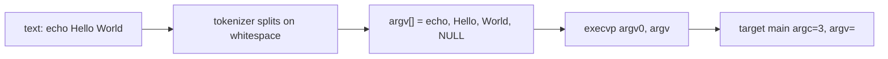

# Argument Passing

Status: **Approved baseline** (Phase 0)

The central idea of this project, documented end to end: how typed
text becomes a NULL-terminated `argv[]` and arrives at the target
program's `main(argc, argv)`.

---

## 1. The contract

The kernel-facing interface for passing arguments to a newly executed
program is an array of pointers to char strings, **terminated by a NULL
pointer**:

```c
char *argv[] = { "echo", "Hello", "World", NULL };
/*                   ^       ^        ^       ^         */
/*                argv[0]  argv[1]  argv[2]  argv[3]    */
```

`argc` is the number of strings before the NULL terminator. The NULL
terminator itself is **not** counted. `execvp()` and the target
program's `main()` both rely on this layout (`exec(3p)` POSIX
manual: "The null pointer terminating the argv array is not counted in
argc").

---

## 2. What the runner must build

Given a user line:

```text
echo Hello World
```

`caps` must produce exactly:

| Index  | Value    | Meaning                          |
| ------ | -------- | -------------------------------- |
| argv[0]| `"echo"` | program name (convention)        |
| argv[1]| `"Hello"`| first argument                    |
| argv[2]| `"World"`| second argument                   |
| argv[3]| `NULL`   | terminator (required)            |

with `argc == 3`.

Rule enforced by the parser module:

```text
argv[argc] == NULL
```

unconditionally.

---

## 3. The transmission path



Steps, in the order `caps` performs them:

1. **Read** the whole line (`getline()`).
2. **Tokenize** on whitespace boundaries, skipping empty fields:
   `echo`, `Hello`, `World`.
3. **Allocate** a `char *` per token; allocate one extra slot for the
   terminator.
4. **Write** the tokens and the trailing `NULL`.
5. **Hand** the array to `execvp(argv[0], argv)`.

---

## 4. Why `argv[argc]` must be NULL

Two consumers of the array are length-agnostic and scan until they hit
the NULL:

- `execvp()` walks `argv` to copy the argument vector into the new
  process image;
- the loaded program's `main(argc, argv)` iterates while `argv[i] !=
  NULL`.

If the terminator were missing, both would overrun the array — undefined
behavior. This is why the parser module *guarantees* the terminator as
an invariant, not as an afterthought.

---

## 5. `argv[0]` and the program name

By convention (`exec(3p)`), `argv[0]` holds the name of the program
being executed. `caps` passes the first token, the command word, so a
program like `basename`/`ps` sees a sensible name. Some programs print
or re-exec `argv[0]`, so the convention matters in practice, but the
kernel does not require it to match the executable file's real name —
`execvp()` uses the *file* argument for lookup and `argv[0]` purely as
data.

---

## 6. `argc`/`argv` at the destination

When `execvp()` succeeds, the child process image is replaced. The new
program's `main()` receives:

```c
int main(int argc, char *argv[])
```

| Pieces | Source                                        |
| ------ | --------------------------------------------- |
| `argv` | the exact array built by the parser            |
| `argc` | recomputed per-process as the number of strings before the NULL terminator |

So `echo Hello World` reaches the target with `argc == 3` and the array
above. **This is the entire point of the project**: the argument
vector is passed, unchanged, from typed text to the running program.

---

## 7. Trailing detail: the text and the tokens differ

The user's line includes whitespace and a newline; the tokens do not:

```text
"  echo   Hello World  \n"
   ^^   ^^^^^          ^^^
   leading space, runs of spaces, trailing space + newline (dropped)
```

Whitespace is only a *separator*; it is never part of a token. The
parser discards it, so arguments arrive clean. Multiple consecutive
spaces behave exactly like one space (single-space compression).

---

## 8. Parser edge cases the test suite covers

| Input                  | argv                             | argc |
| ---------------------- | -------------------------------- | ---- |
| *(empty line)*         | `{ NULL }`                       | 0    |
| `"    \n"` (spaces)    | `{ NULL }`                       | 0    |
| `"ls\n"`               | `{ "ls", NULL }`                 | 1    |
| `"ls -la\n"`           | `{ "ls", "-la", NULL }`          | 2    |
| `"  echo hi  there  "` | `{ "echo", "hi", "there", NULL }`| 3    |
| `"echo\thi\tworld"`    | `{ "echo", "hi", "world", NULL }`| 3    |

The last row is a *target*: whitespace in the initial parser means
spaces **and** tabs. A tab-containing line must tokenize identically to
its space-separated equivalent. (This behavior is implemented and
tested in Phase 4.)

---

## 9. What the parser deliberately does *not* do

Documented limitations (single space rule aside):

- no quoted strings — `echo "hello world"` stays **three** tokens:
  `"` is a regular character;
- no escapes — backslash is literal;
- no glob expansion — `*.c` is passed literally;
- no environment or tilde expansion — `$HOME`, `~` stay literal;
- no pipes, redirection, background `&`, `&&`, `||`.

Each limitation is intentional and keeps the argument-passing story
clear. A future tokenizer may add quoting; the module boundary makes
that a local change.

---

## 10. Educational takeaway

Arguments are not "handed over" by magic. The runner:

```text
types in words
    -> stores each word as its own C string
    -> arranges the pointers in a NULL-terminated array
    -> execvp() copies that array into the new process image
    -> the new program's main() reads the same array
```

`argv` is the messenger between the runner's parser and the loaded
program's `main()`. This project makes that messenger visible and
inspectable in debug mode.