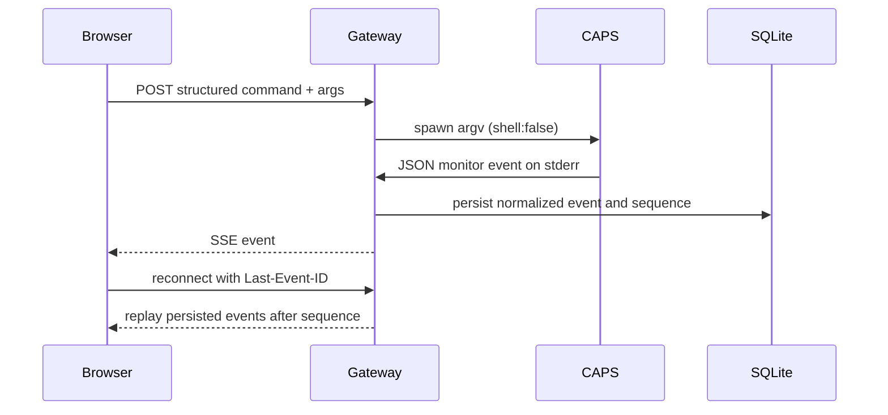

# CAPS observability model

CAPS records lifecycle facts emitted by its C monitor and adds a gateway envelope for transport and persistence. A visualization must keep those sources distinguishable.

## Sources and confidence

| Displayed value | Source | Meaning |
| --- | --- | --- |
| Command and argument vector | Validated gateway request | `command` and `args` arrive as separate fields; web execution does not tokenize a raw shell command line. |
| Child PID | `PROCESS_STARTED` from CAPS | PID of the child created by `fork()`. |
| Exit code / signal | `PROCESS_EXITED` and `SIGNAL_RECEIVED` | Interpreted from the raw `waitpid()` status by the C engine. A signal exit uses shell-style `128 + signal` as an application convention. |
| Duration | `CLOCK_MONOTONIC` in CAPS | Milliseconds measured from process launch through reap. |
| Event timestamp | Gateway receive time | Wall clock when the gateway reads the monitor event; not a kernel timestamp. |
| Event sequence | Gateway per-session counter | Ordered event identity used by SQLite and SSE recovery. |
| Exec success | Derived from a later ordinary process exit without a signal event | There is no independent successful-exec event. A close-on-exec status pipe lets CAPS distinguish a real `execvp()` failure from an application that exits 126 or 127. |
| Linux PID | `PROCESS_STARTED` from CAPS | Actual child PID; procfs snapshots are restricted to this PID while the execution remains tracked. |
| CAPS engine PID | Node `child_process.spawn` result | Gateway-observed Linux PID of the CAPS monitor. A process-tree edge is shown only when procfs PPID matches it. |
| PPID, process group, SID, command name, state | `/proc/<pid>/stat` and `/proc/<pid>/status` | Kernel-exposed attributes read for the tracked PID; start ticks are checked to reject PID reuse. |
| RSS, virtual size, threads, context switches | `/proc/<pid>/status` | Procfs counters. Missing entries, fields, or permissions yield `UNAVAILABLE` with a reason, never zero. |
| User/system CPU time | `/proc/<pid>/stat` utime/stime | Tick counters converted with Linux `getconf CLK_TCK`; displayed as `DERIVED`. If the tick rate cannot be read, both values are unavailable. |
| Start time and elapsed time | `/proc/<pid>/stat` start ticks plus `/proc/uptime` | Derived kernel-relative timing; distinct from the gateway event receive timestamp. |
| CPU utilization | Consecutive valid CPU-time samples and monotonic sampler interval | Derived as CPU delta divided by sample interval; the first sample is unavailable and multithreaded processes can exceed 100%. |

## Event path

SQLite stores the canonical envelope and normalized payload. The event inspector shows this envelope; it is not a byte-for-byte copy of the original C line.

## Out of scope today

No syscall tracer or independent successful `execvp()` acknowledgement is active. The `/proc` sampler is scoped to registry-owned CAPS children, reads immediately after `process.started`, then every 500 ms, and stops on observed child exit or exec error. Each `process.snapshot` is persisted before SSE publication; replay reads the stored snapshot events without re-execution or live procfs access. Before sampling, the gateway verifies that the child's observed PPID matches the CAPS PID returned by its own spawn call.

## References

- POSIX [`wait()` / `waitpid()`](https://pubs.opengroup.org/onlinepubs/9699919799/functions/wait.html) specifies that the parent obtains status for its child process.
- Linux [`fork(2)`](https://man7.org/linux/man-pages/man2/fork.2.html), [`execve(2)`](https://man7.org/linux/man-pages/man2/execve.2.html), and [`waitpid(2)`](https://man7.org/linux/man-pages/man2/wait.2.html) describe process creation, image replacement, and reaping.
- Linux [`/proc/<pid>/stat`](https://man7.org/linux/man-pages/man5/proc_pid_stat.5.html) defines available process identity/state fields; CAPS does not collect them yet.
- OpenTelemetry [process attributes](https://opentelemetry.io/docs/specs/semconv/registry/attributes/process/) provide established names such as `process.pid`, `process.parent_pid`, `process.state`, and `process.working_directory`.
- UI concepts were reviewed from [Microsoft Process Monitor](https://learn.microsoft.com/sysinternals/downloads/procmon), [htop](https://github.com/htop-dev/htop), [`strace(1)`](https://man7.org/linux/man-pages/man1/strace.1.html), and [Grafana Live](https://grafana.com/docs/grafana/latest/setup-grafana/set-up-grafana-live/): inspectable events, process trees, filtering, syscall evidence, and event-driven updates. CAPS borrows these interaction concepts without claiming their broader telemetry.
