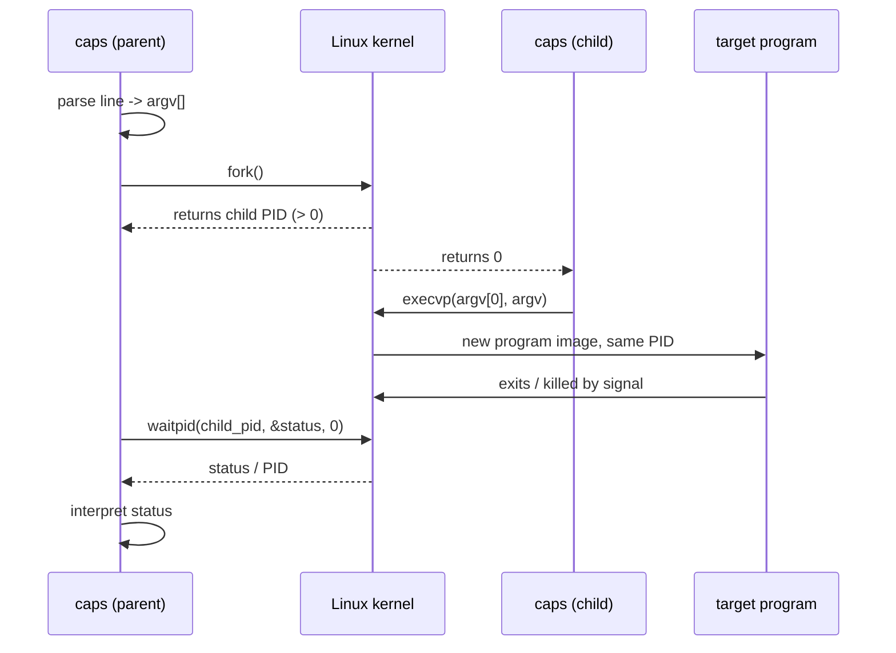

# Process Lifecycle

Status: **Approved baseline** (Phase 0)

Educational companion explaining the parent/child lifecycle behind
every external command executed by `caps`.

---

## 1. The lifecycle in one picture



The child created by `fork()` becomes the target program via
`execvp()` *without changing its PID*. The parent is the only process
that ever talks to the terminal prompt again.

---

## 2. `fork()` — create a child

Signature (Linux/glibc):

```c
#include <unistd.h>

pid_t fork(void);
```

What it does (Linux man-pages 6.18, `fork(2)`):

- creates a new process by duplicating the calling process;
- the two processes initially run in **separate memory spaces** with
  identical contents (copy-on-write pages on Linux);
- the child gets its own PID and its own `getppid()` = parent's PID.

### Return value (from `fork(2)`)

| Return value | Meaning                                        |
| ------------ | ---------------------------------------------- |
| `< 0` (-1)   | failure; no child created; `errno` set         |
| `0`          | **in the child**                              |
| `> 0`        | **in the parent**; the child's PID             |

The same call returns *twice*: the parent receives the child PID,
the child receives `0`. All code must branch immediately:

```c
pid = fork();

if (pid < 0) {
    /* parent: error path */
} else if (pid == 0) {
    /* child: exec path */
} else {
    /* parent: wait path */
}
```

### Children are born, not invoked

`fork()` does **not** run a program. It clones the running one. The
clone is a full copy of `caps` (stack, heap, opened file descriptors,
environment). If the child returned normally into the loop, two copies
of the REPL would be fighting over the terminal — hence the child must
immediately `exec` or `_exit`.

---

## 3. `execvp()` — replace the child with the target program

Signature:

```c
#include <unistd.h>

int execvp(const char *file, char *const argv[]);
```

What it does (`exec(3)`, `execve(2)`):

- replaces the calling process's memory image (text, data, stack, heap)
  with a new program loaded from disk;
- the `'p'` variant searches `PATH` when `file` contains no `/`;
- `argv` must be terminated by a `NULL` pointer — `caps` guarantees
  `argv[argc] == NULL`;
- the PID, open file descriptors (unless `FD_CLOEXEC`), current working
  directory, and environment are inherited.

### The crucial property

> On success, `execvp()` **does not return**.

There is no way back into the child's pre-`exec` code. Therefore the
child-side only needs failure handling after the call:

```c
execvp(argv[0], argv);

/* survives only on failure */
fprintf(stderr, "caps: %s: %s\n", argv[0], strerror(errno));
_exit(127);
```

### `exec` fails — process-level consequences

A failed `execvp()` does not kill the child on its own; the child is
still alive (still running `caps`' code). The child must terminate
itself, and it must use `_exit()` rather than `exit()`:

- the child holds a copy of stdio buffers from the parent;
- `exit()` would flush those buffers, corrupting the parent's pending
  output;
- `_exit()` performs the kernel exit immediately, skipping stdio
  cleanup — it is async-signal-safe and appropriate inside the branch
  after `fork()`.

---

## 4. `waitpid()` — synchronize with the child

Signature:

```c
#include <sys/wait.h>

pid_t waitpid(pid_t pid, int *wstatus, int options);
```

What it does (`wait(2)`):

- suspends the caller until the specified child changes state;
- with `pid > 0` it waits for that exact child;
- `wstatus` receives the encoded status information;
- `options = 0` means: block until that child terminates (no WNOHANG).

| Return value            | Meaning                                    |
| ----------------------- | ------------------------------------------ |
| child PID               | the waited child terminated                |
| `-1`                    | error; `errno` set (e.g. ECHILD, EINTR)    |

### Why the parent must wait

- The parent promised to observe the child's outcome; without a `wait*`
  the child becomes a **zombie** (a terminated process holding a slot
  in the process table) once it exits.
- `waitpid()` is the only rendezvous: it blocks the parent until the
  child finishes, then harvests the status.

```c
pid_t done = waitpid(child_pid, &status, 0);

if (done == -1) {
    perror("caps: waitpid");
    /* continue the REPL */
}
```

---

## 5. Interpreting the status

`waitpid()` packs the child's outcome into one `int`. The macros from
`<sys/wait.h>` (POSIX.1-2017) decode it.

| Macro                | True when / returns                          | Use after        |
| -------------------- | -------------------------------------------- | ---------------- |
| `WIFEXITED(s)`       | child terminated normally                     | any status       |
| `WEXITSTATUS(s)`     | the exit code (low-order 8 bits)              | `WIFEXITED` true |
| `WIFSIGNALED(s)`     | child terminated by an uncaught signal        | any status       |
| `WTERMSIG(s)`        | the terminating signal number                 | `WIFSIGNALED` true |

```c
if (WIFEXITED(status)) {
    int code = WEXITSTATUS(status);
    /* normal: code 0..255 */
} else if (WIFSIGNALED(status)) {
    int sig = WTERMSIG(status);
    /* killed by signal sig */
} else {
    /* WIFSTOPPED/WIFCONTINUED — not enabled (options=0) */
}
```

Note that `WIFEXITED` and `WIFSIGNALED` are *not* exhaustive without
WUNTRACED/WCONTINUED; with `options == 0` the stopped/continued cases
cannot occur and only the two branches above are reachable for a
terminated child.

### Exit value conventions for `caps` child side

- `0`: success path.
- Non-zero: program failed, or `execvp()` itself failed. Shell
  convention: `127` = command not found; `126` = found but not
  executable. `caps` uses these for compatibility with scripts.

---

## 6. The full child region

Between `fork()` returning `0` and the successful `execvp()`, the
child must only do small, defined work:

```text
child:
  -> execvp(argv[0], argv)          # the whole point
  -> execvp failed:
       print error to stderr
       _exit(127)                   # never return into the loop
```

Anything else the shell needs done (reaping, prompt, next command) is
parent work. The child executes for exactly one command and then
either becomes the requested program or dies.

---

## 7. Zombies and orphans (documented behavior)

- **Zombie:** a child that terminated but has not been `wait`ed. It
  consumes a process-table slot until reaped. `caps` avoids zombies by
  always reaping synchronously in `waitpid()`.
- **Orphan:** a child whose parent died first. Linux re-parents orphans
  to PID 1 (init/systemd). `caps` never intentionally orphans children:
  the parent waits before reading the next command.

---

## 8. Signals (current behavior, Phase 7+)

How `caps` behaves today (see `docs/signals.md` for the full model):

- A signal delivered to the child process (e.g. SIGKILL, SIGSEGV)
  is reported by the parent as `terminated by signal N` via
  `WIFSIGNALED`/`WTERMSIG`. This is *status reporting*, not signal
  handling.
- SIGINT: the parent ignores it for its lifetime
  (`SIG_IGN` set in `signals_parent_init()`), so Ctrl+C never kills
  the prompt. The kernel still *delivers* the signal to the parent
  (both are in the same foreground terminal session), but the `SIG_IGN`
  disposition discards it.
- The child resets SIGINT to `SIG_DFL` immediately after `fork()`
  (`signals_child_reset()`), because POSIX `exec` *preserves* `SIG_IGN`
  dispositions — without the reset a foreground child such as
  `sleep 5` would ignore Ctrl+C too. A child that dies on SIGINT is
  reported as `terminated by signal 2` with status `130`.

Limitation (documented honestly): `caps` does **not** implement job
control — no process groups, no foreground/background assignment, no
`SIGTSTP` resume machinery.

---

## 9. Sequences a reader should be able to explain

1. `caps> echo hi` — full `fork`/`exec`/`wait` cycle with exit 0.
2. `caps> false` — full cycle, exited with status 1.
3. `caps> sleep 5` then Ctrl+C — child killed by SIGINT, parent
   reports signal termination (Phase 7 behavior).
4. `caps> no_such_thing` — `execvp` fails in the child, child `_exit(127)`,
   parent reports `command not found`, prompt returns.