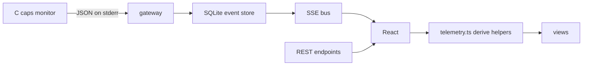

# Visualization architecture — Flight Recorder 2.0

How the frontend turns persisted canonical events into the synchronized
flight recorder, peaks & moments, comparison, and report views — and how
each value stays traceable to a source.

## Data flow

Every visualization reads canonical events with a per-session sequence,
gateway receive timestamp, and type. Nothing is simulated; nothing is
re-executed during replay, export, comparison, or report generation.

## Views and their evidence

| View | Reads | Sources shown |
| --- | --- | --- |
| State strip | lifecycle events (`command.executing` → `process.started` → `process.exited` / `exec.exec_error` / `exec.timeout`) | Which real stage triggered the transition |
| Resource curves (RSS / CPU%) | `process.snapshot` payloads | OBSERVED VmRSS bytes; CPU% DERIVED from tick deltas |
| Event annotations on the curves | `process.signal` / `exec.timeout` / `process.exited` timestamps | Wall-clock markers on the same time axis |
| Replay cursor line | ReplayPanel cursor (`t` seconds) | Scrubs through the recorded timeline, synchronized to panels |
| Peaks & moments | `deriveRuntimePeaks` | Peak RSS (OBSERVED), peak CPU% (DERIVED), median RSS (DERIVED), CPU time (DERIVED), sampling span (DERIVED) |
| Event stream filters | EventStream chip state | Same events, subset view; counts stay real |
| Sequence integrity badge | `sequenceIntegrity` | Missing/duplicate per-session sequence numbers = lost events between write and read |
| Command profiles | `GET /api/analytics/commands` | Per-command rates/percentiles/RSS from stored sessions; `null` renders `—` |
| Comparison | `GET /api/analytics/compare` | Two stored sessions side by side; deltas right-minus-left |
| Export | `GET /api/sessions/:id/export` | Canonical JSON or RFC 4180 CSV of the persisted timeline |
| Observation report | `GET /api/sessions/:id/report` | Markdown summary generated server-side from the event store |

## Truthfulness rules implemented in code

1. A card or chart never substitutes zero for a missing value. MiB from a
   null RSS renders `UNAVAILABLE` in the peaks panel and a gap in the chart.
2. CPU% requires two valid CPU-time samples; the first sample is a gap.
3. The replay cursor line is drawn only while replay is active (`highlightMs`
   non-null); in live mode there is no cursor to misinterpret.
4. The sequence badge states `contiguous · no gaps` only when the stored
   sequences form an exact `1..n` run. Any gap is shown as a warning with the
   missing count — evidence of dropped events, not hidden.
5. Peaks panel labels each number `OBSERVED`, `DERIVED`, or the reason a
   value is `UNAVAILABLE` (e.g. "Needs ≥2 valid samples").

## Motion policy

The replay cursor is the only time-driven motion in these views. Curves
grow when real `process.snapshot` events arrive; annotations appear when
their lifecycle events arrive. No entering/updating animation fakes live
progress. Reduced-motion is handled globally in `src/styles/index.css`.

## Implementation map

- `web/frontend/src/lib/telemetry.ts` — `deriveRuntimePeaks`, `buildTimeline`,
  `sequenceIntegrity` (frontend mirrors of the backend derivations).
- `web/backend/src/analytics/service.ts` — `computeRuntimePeaks`,
  `computeCommandProfiles`, `compareSessions` (server truth).
- `web/frontend/src/components/execution/Timeline.tsx` — curves + state strip
  + annotations + replay cursor.
- `web/frontend/src/components/execution/PeaksPanel.tsx`,
  `web/frontend/src/components/execution/SequenceBadge.tsx`.
- `web/frontend/src/components/execution/ReplayPanel.tsx` — cursor owner;
  publishes `onCursorMs` for cross-panel sync.
- `web/frontend/src/components/execution/EventStream.tsx` — type filter chips.
- `web/frontend/src/pages/ComparePage.tsx`, `web/frontend/src/pages/AnalyticsPage.tsx`.
- `web/backend/src/api/routes.ts` — export / report / commands / compare.

Anything a view shows but cannot source is documented here and labelled in
the UI; there is intentionally no "default chart" that pretends data exists.
